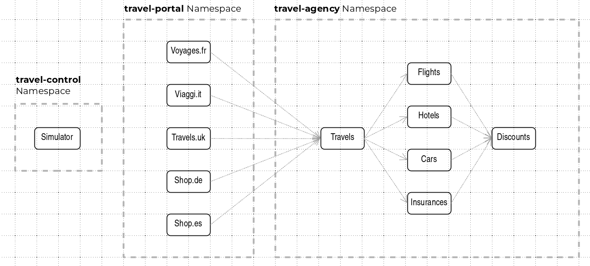

= ossm-heading-to-production-and-day-2
:toc:

The technical content of the "Heading to production with OSSM & Day 2 Operations Book"

== Context

The IT department of a _Travel Agency_ operates a system architecture supporting travel business.

* Operates its own travel portal / booking platform NOT in a _Service Mesh_.
* Operates travel portal tenants for customers/partners.
* Operates a microservices backend architecture with services for travels, hotels, flights etc.
* It handles options to include external travel portals using the travel services.
* It handles integrations with external travel service for specific travels/countries.
* _Product Team TP_ owns travel portals (infra and apps).
* _Product Team TS_ for travel services (infra and apps).
* Various Users interact with the solution during Development and Production activities.
** One Product Owner (business) exists for the complete travel platform.
** Platform Admin handles the Openshift Container Platform operators maintenance.
** _Service Mesh_ Operator manages the _Service Mesh_ _control plane_.
** Mesh Developers create traffic _Service Mesh_ configurations.

== Part 1: Scenarios Heading to Production

1. link:scenario-1-kick-off-meeting/README.adoc[Kick Off Meeting: Requirements and prerequisites of using the Service Mesh]
2. link:scenario-2-dev-setup/README.adoc[Setting up the (TP and TS Teams) DEV environment and moving application in the Mesh]
3. link:scenario-3-prod-basic-setup/README.adoc[Setting up the Travel Production environment]
4. link:scenario-4-onboard-new-portal-with-authentication/README.adoc[New Business Opportunity: Onboarding an external travel portal to existing travel-agency]
5. link:scenario-5-new-regulations-mtls-everywhere/README.adoc[New regulation to secure all information]
6. link:scenario-6-partner-agency-multi-mesh/README.adoc[Company has a new travel agency as a partner. Use their services for specific countries and customers]

== Part 2: Scenarios Day 2 Operations

7. link:scenario-7-mesh-troubleshooting/README.adoc[Troubleshooting the Mesh]
9. link:scenario-8-mesh-tuning/README.adoc[Tuning the Mesh]
10. link:scenario-9-mesh-upgrade/README.adoc[A New version of OSSM is out]

