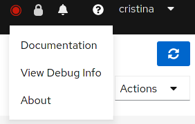
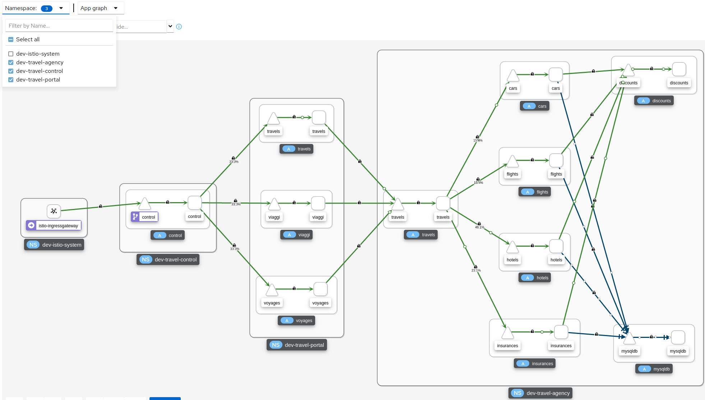
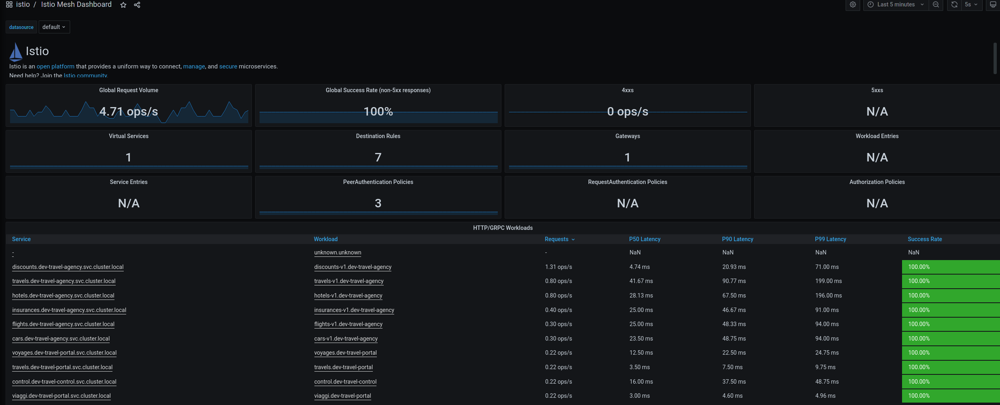
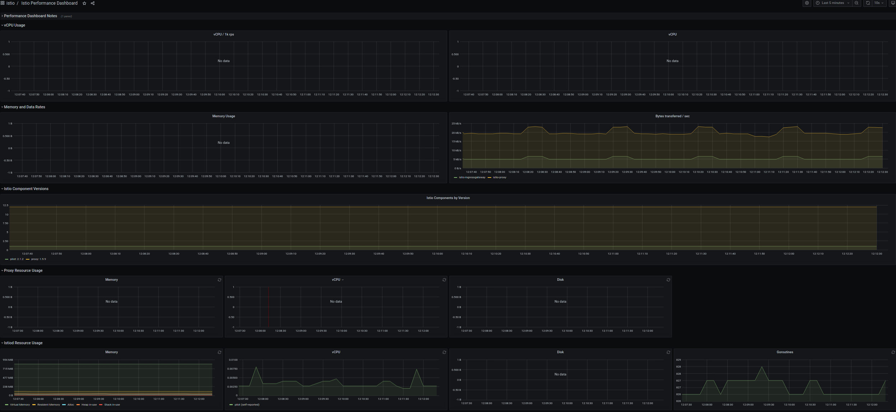
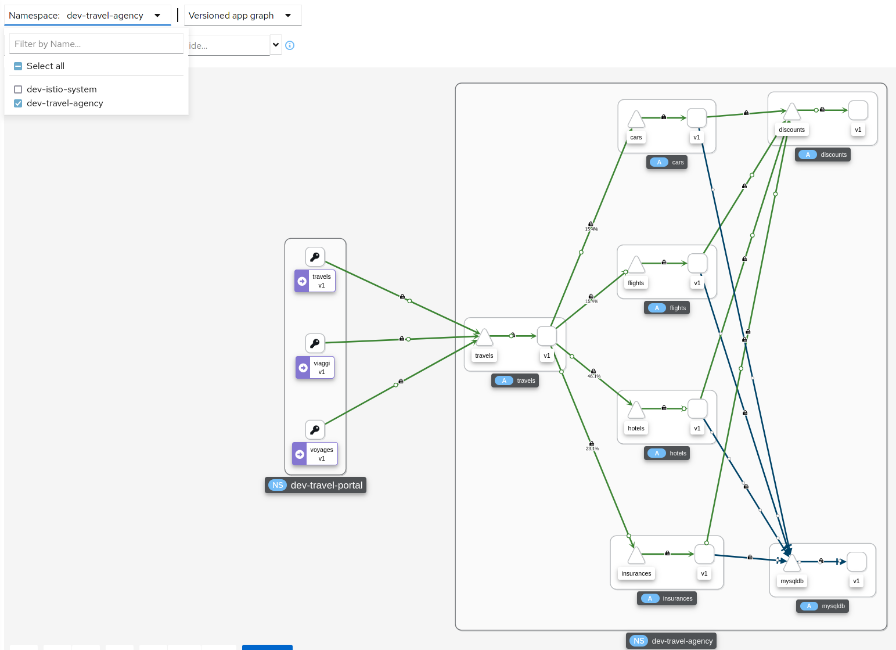
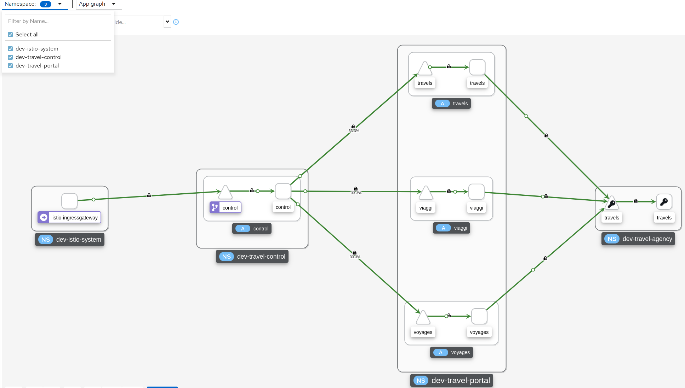

= Setting up a DEV environment for the `Travel Portal` and `Travel Agency` Teams
:toc:

[NOTE]
====
All actions to reference a Role to be performed under
====

== Who are the Mesh Users?

The xref:../scenario-1-kick-off-meeting/README.adoc#mapping-enterprise-users-to-roles-in-the-dev-environment[`DEV` Environment users] have been defined during `Kick Off Meeting`

== Setup `DEV` Environment

=== Platform Admin - Operators, Namespace, User/Roles Preparation Actions

* Define URL of the CLUSTER for the users to login at
+
----
export CLUSTER_API=<YOUR-CLUSTER-API-URL>
----

[NOTE]
====
Actions with role `Cluster Admin`
====

1. As *phillip* (`Cluster Admin`) add the `OSSM` Operators in the OCP Cluster via the `Openshift Market Place`
+
----
cd ossm-heading-to-production-and-day-2/scenario-2-dev-setup
./login-as.sh phillip
../common-scripts/add-operators-subscriptions-sm.sh
----

2. As *phillip* (`Cluster Admin`) once the operators have been successfully installed create the necessary *Development* _Travel Agency_ Namespaces
+
----
./login-as.sh phillip
../common-scripts/create-travel-agency-namespaces.sh dev
----

3. As *phillip* (`Cluster Admin`) create the xref:../scenario-1-kick-off-meeting/README.adoc#roleusercreation[`Service Mesh Roles`]

4. As *phillip* (`Cluster Admin`) create the xref:../scenario-1-kick-off-meeting/README.adoc#mapping-enterprise-users-to-roles-in-the-dev-environment[`DEV` Service Mesh Users and assign Roles]

=== Mesh Operator - Service Mesh Control Namespace and `ServiceMeshControlPlane` Creation

[NOTE]
====
Actions with role `Mesh Operator`
====

----
./login-as.sh emma
./scripts/create-dev-smcp.sh dev-istio-system dev-basic
----

=== Domain Owner - Application Namespaces Service Mesh Membership enrollnment and applications deployment

[NOTE]
====
Actions with role `Mesh Developer`
====

1. As *farid* (`Mesh Developer`) _Travel Services Domain Owner (Tech Lead)_ deploy the applications to `dev-travel-agency` namespaces

** Check labels on projects prior to `SMM` creation
+
----
./login-as.sh farid
../common-scripts/check-project-labels.sh dev-travel-agency
----

** Add `SMM` with `dev-travel-agency` namespace to `dev-basic` `ServiceMeshControlPlane` service mesh in `dev-istio-system`
+
----
./login-as.sh farid
../common-scripts/create-membership.sh dev-istio-system dev-basic dev-travel-agency
../common-scripts/check-project-labels.sh dev-travel-agency
----

** Deploy the Applications in `dev-travel-agency` namespaces
+
----
./login-as.sh farid
./scripts/deploy-travel-services-domain.sh dev dev-istio-system
----

2. As *cristina* (`Mesh Developer`) _Travel Portal Domain Owner (Tech Lead)_ add the `ServiceMeshMember` (`SMM`) (service mesh membership) resource for `dev-travel-control`, `dev-travel-portal` namespaces
+ 
** Check labels on projects prior to `SMM` creation
+
----
./login-as.sh cristina
../common-scripts/check-project-labels.sh dev-travel-control
../common-scripts/check-project-labels.sh dev-travel-portal
----

** Add `SMM` with namespaces to `dev-basic` `ServiceMeshControlPlane` service mesh in `dev-istio-system`
+
----
./login-as.sh cristina
../common-scripts/create-membership.sh dev-istio-system dev-basic dev-travel-control
../common-scripts/check-project-labels.sh dev-travel-control
../common-scripts/create-membership.sh dev-istio-system dev-basic dev-travel-portal
../common-scripts/check-project-labels.sh dev-travel-portal
----

** Deploy the Applications in `dev-travel-control`, `dev-travel-portal` namespaces and `Istio` configs to expose Service Mesh services
+
----
./login-as.sh cristina
./scripts/deploy-travel-portal-domain.sh dev dev-istio-system
----

=== Mesh Operator - Travel Agency Portal exposure via Istio `Gateway` creation

[NOTE]
====
Actions with role `Mesh Operator`
====

* Create Istio `Gateway` resource (Refer to xref:../scenario-1-kick-off-meeting/README.adoc#user-governance-capture[User Governance Capture - Self Service] for the decision to create `Gateway` as a `mesh operator`)

----
./login-as.sh emma
./scripts/create-ingress-gateway.sh dev-istio-system
----

== `Dev` Setup Verification & Observability Usage

* Logged in (as one of `phillip`, `emma`, `cristina`, `farid`) execute the following and use the URL of the following execution in a browser. You should reach the *Travel Control Dashboard*

----
./login-as.sh <choose>
echo "http://$(oc get route istio-ingressgateway -o jsonpath='{.spec.host}' -n dev-istio-system)"
----

=== Access `Observability Stack`

* Logged in (as one of `phillip`, `emma`, `cristina`, `farid`) execute the following to retrieve the URLs of the `OSSM` Observability Stack (`Kiali`, `Jaeger`, `Prometheus`, `Grafana`) components.

----
./login-as.sh <choose>
echo "http://$(oc get route kiali -o jsonpath='{.spec.host}' -n dev-istio-system)"
echo "https://$(oc get route jaeger -o jsonpath='{.spec.host}' -n dev-istio-system)"
echo "https://$(oc get route prometheus -o jsonpath='{.spec.host}' -n dev-istio-system)"
echo "https://$(oc get route grafana -o jsonpath='{.spec.host}' -n dev-istio-system)"
----

* Alternatively so long as you have logged into `Kiali` access the `Grafana` and `Jaeger` URLs by clicking on *?* next to your name (top-right KIALI corner), then *About* and you should have the URLs presented.

=== Use the `Observability` stack as `Product Owner` for the Travel-Agency Solution

[NOTE]
====
Access `Kiali` URL as (username/password) `mus`/`mus` (role `Application Viewer`)
====

* As the `Product Owner` you have *view* access to all 3 _data plane_ namespaces and the _control plane_ namespace. You are allowed to:
+

+
** see traces for the overall solution. From the `Kiali` menu on the left go to `Distributed Tracing` and login with your credentials to view the tracing console
** see metrics for the overall solution.Go to `Workloads` in `Kiali` and select one application workload. Use the `inbound` or `outbound` metrics. Alternatively, go to the `Prometheus` URL (identified above) and login with your credentials. Apply on the `Graph` view 
*** `istio_requests_total{destination_workload="discounts-v1", app="discounts"}` to visualize requests towards `discounts-v1`
*** `istio_request_duration_milliseconds_count{app="discounts"}`
*** `istio_response_bytes_bucket`
** see dashboards in grafana for the solution. Access the `Grafana` URL as 'mus/mus' (role `Application Viewer`, See above on how to find the URL)
*** Check the 'status' of the overall Travel Agency solution *Dashboards -> Manage -> Istio -> Istio Mesh Dashboard*

*** Check the 'performance' of the overall Travel Agency solution *Dashboards -> Manage -> Istio -> Istio Mesh Dashboard*

==== Verifying RBAC restrictions for the `Product Owner` are in place
[WARNING]
====
As `Product Owner` You are not allowed to view or modify the Istio Configurations or the Istio logs
====

* You should not be able see configs in the `Kiali`. If you select in the menu to the left `Istio Config` and then try to see a config, it fails to access one of the configs.
* You cannot access logs in the `Kiali`. If you select in the menu to the left go to `Workloads` and access one of the workloads, it has no logs if you try to see them

=== Use the `Observability` stack as a `Domain Owner` for the Travel-Portal or Travel-Services Domain

[NOTE]
====
Access `Kiali` URL as (username/password) `farid`/`farid` or `cristina`/`cristina` (role `Mesh Developer`)
====

* As the `Domain Owner` of one of the _Travel Portal_ or _Travel Services_ domains you have *view* access to 
** *Travel Portal* Domain: 2 _data plane_ namespaces (`dev-travel-control`, `dev-travel-portal`) and the _control plane_ namespace (see Kiali view link:./images/kiali-cristina-domain-owner-tp.png[for cristina]).
** *Travel Services* Domain: 1 _data plane_ namespace (`dev-travel-agency`) and the _control plane_ namespace (see Kiali view link:./images/kiali-farid-domain-owner-ts.png[for farid]). 
* You are also allowed to:
** see traces for the overall solution. From `Kiali` menu on the left go to `Distributed Tracing` and login with your credentials to view the tracing console
** see metrics. Go to `Prometheus` URL (identified above) and login with your credentials. Apply on the `Graph` view the appropriate metrics views required
** see logs for the workloads in your domain. From the `Kiali` menu on the left go to `Workloads` and access one of the workloads, the tab `Logs` has both proxy and pod logs available (see link:./images/kiali-logs-cristina-domain-owner.png[Logs screenshot])
** see and modify Istio Configs for your domain. From the `Kiali` menu on the lef to go to `Istio Config`. You should be able to access the configs as *cristina* for the control `VirtualService` and `DestinationRule` (see link:./images/kiali-configs-cristina-domain-owner.png[Configs screenshot)]
** see dashboards (See above on how to find the URL)
*** Check the 'status' of the services and workloads in the `dev-travel-portal` or `dev-travel-agency` by viewing
*** *Dashboards -> Manage-> Istio -> Istio Service Dashboard*) dashboard or (see  link:./images/grafana-istio-service-dashboard.png[Istio Service Dashboard])
*** *Dashboards -> Manage-> Istio -> Istio Workloads Dashboard*)  dashboards (see  link:./images/grafana-istio-workload-dashboard.png[Istio Workloads Dashboard])

=== Use the `Observability` stack as `Developer` for the Travel-Portal or Travel-Services Domain

[NOTE]
====
Access `Kiali` URL as `mia`/`mia` (role `Application Viewer`)
====

* As a `Developer` for the _Travel Services_ domain *mia* is interested in viewing functional, performance or configuration issues with the workloads in the `dev-travel-agency`. Therefore, access is given to that service mesh namespace while the _Travel Portal_ domain namespaces and the service mesh control plane namespace are restricted (padlock icon).
* *mia* is allowed as an `Application Viewer` to check the `traces` of the worloads, `metrics` for the same workloads and `dashboards` for the overall solution.

[NOTE]
====
Access `Kiali` URL as `john`/`john` (role `Application Viewer`)
====

* As a `Developer` for the _Travel Portal_ domain *john* is interested in viewing functional, performance or configuration issues with the workloads in the `dev-travel-portal` and to a lesser extent the `dev-travel-control` simulator. Therefore, access is allowed to those service mesh namespaces while the _Travel Services_ domain namespaces and the service mesh control plane namespace are restricted (padlock icon).

==== Verifying RBAC restrictions for the `Application Viewer` are in place

* *john* is allowed as an `Application Viewer` to check the `traces` of the worloads, `metrics` for the same workloads and `dashboards` for the overall solution.
* *john* is allowed to view via the `Istio Config` section that there are configs for the `dev-travel-control` namespace (see link:./images/kiali-configs-cristina-domain-owner.png[Configs screenshot)] but he is not allowed to view details or modify them.

=== Use the `Observability` stack as `Mesh Operator`

[NOTE]
====
Access `Kiali` URL as `emma`/`emma` (role `Mesh Operator`)
====

* As the `Mesh Operator` you have *full* access to all 3 _data plane_ namespaces and the _control plane_. 
** In `Kiali` go to *Graphs -> App Graph*, select from *Display* `Request Distribution`, `Namespace Boxes`, `Traffic Animation`, `Security` and see the link:./images/kiali-emma-mesh-operator.png[Mesh Operator view]) 
** In addition from the `Kiali` menu on the left to go to `Istio Config`. You should be able to access or modify any config as the administrator of this mesh
** You can in addition access logs of the workloads. From the `Kiali` menu on the left go to `Workloads` and access one of the workloads, it has both proxy and pod logs available
** Finally, you can like the previous users access `prometheus`, `jaeger` and `grafana`. On the latter there is a dashboard to visualize the state of the service mesh _control plane_
*** *Dashboards -> Manage-> Istio -> Istio Control Plane Dashboard*)  dashboards (see  link:./images/grafana-cp-dashboard.png[Istio Control Plane Dashboard])

== RESET Actions

----
./scripts/reset-dev-setup.sh
----

