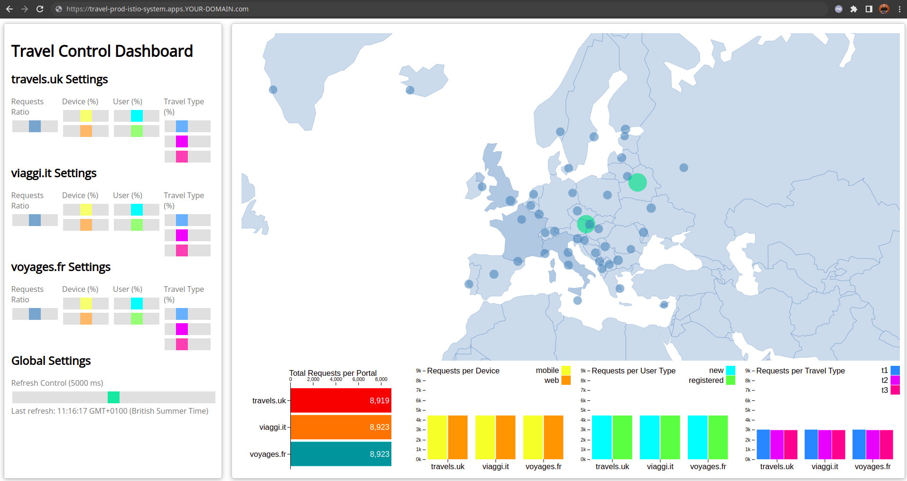

= Setting up the production environment
:toc:

[[requirements]]
== Requirements focused on Production setup

The requirements below are a summary and refinement, based on further analysis, of functional and non-functional _needs_ in production (originally defined during the link:https://github.com/redhat-developer-demos/ossm-heading-to-production-and-day-2/blob/main/scenario-1-kick-off-meeting/README.adoc#requirements-capture-to-drive-mesh-adoption--configuration[Kickoff Meeting Requirements gathering]):

1. The _Development Team_ want to be able to trace `20%` of traffic in Production  (with traces persisted for up to 1 week)
2. The _Product Team_ want to see metrics around performance/usage (with metrics persisted for up to 1 week)
4. The _Platform Team_ want to implement some resiliency to make the overall Service Mesh deployment more stable and reliable.

== Configuring Roles and permissions

For the purpose of managing, monitoring and troubleshooting the Production environment we need specific Enterprise Personas. You can find the description of these link:https://github.com/redhat-developer-demos/ossm-heading-to-production-and-day-2/blob/main/scenario-1-kick-off-meeting/README.adoc#map-to-enterprise-personas-with-roles--key-responsibilities-setup[Personas here].

* Production Mesh Admin (setup `SMCP`, operates the `SMCP`, `SMBR` -observability, scalability, certs etc. and observes the Control Plane)
* Production Application Operator (create/update application mesh configs although it can be assisted by GitOps acting on the setup)
* Production Application Maintenance (view on everything in the mesh -logs, traces, dashboards- extracting the necessary information for debugging and troupleshooting)
* Product Owner wants to view everything
* Team TP has admin access for portals and wants to observe only the portal ns

=== Who are the Mesh Users?

The xref:../scenario-1-kick-off-meeting/README.adoc#user-content-mapping-enterprise-users-to-roles-in-the-higher-prod-environment[`PROD` Environment users] have been defined during `Kick Off Meeting` which will act as these personas.

== Prepare `PROD` Environment

In this section we prepare the `PROD` environment with operators, production namespaces, roles and production user creation.

=== Adding Operators, Namespaces, User/Roles Preparation Actions

* Define URL of the CLUSTER for the users to login at
+
----
export CLUSTER_API=<YOUR-CLUSTER-API-URL>
----

[NOTE]
====
Actions with role `Cluster Admin`
====

----
cd ossm-heading-to-production-and-day-2/scenario-3-prod-basic-setup
./login-as.sh phillip
----

[WARNING]
====
Follow these link:./README-add-operators-and-roles.adoc[operator and roles preps] *ONLY* if you have a separate `PROD` Openshift cluster. If you are using `Service Mesh` multitenancy and namespace based environments (ie. `dev-istio-system`, `prod-istio-system` in the same cluster) then *SKIP those and go directly to the step below*.
====

1. As *phillip* (`Cluster Admin`) once the operators have been successfully installed create the necessary *Production* _Travel Agency_ Namespaces
+
----
./login-as.sh phillip
../common-scripts/create-travel-agency-namespaces.sh prod
----

2. As *phillip* (`Cluster Admin`) create the link:https://gitlab.consulting.redhat.com/servicemesh-in-action/ossm-heading-to-production-and-day-2/-/blob/main/scenario-1-kick-off-meeting/README.adoc#user-content-execute-user-role-creation-for-prod-environment[`PROD` Service Mesh Users and assign Roles]

== `Service Mesh` Production Setup

* *Prerequisite:* `openssl` is required to be in the path (currently tested with `OpenSSL 1.1.1n  FIPS 15 Mar 2022`)

=== Configure `Tracing` for Production

The `Red Hat Openshift Service Mesh (OSSM)` makes the following 2 suggestions on setting up production environment. We will select the _fully customized_ option for the production setup.

* Option 1: link:https://docs.openshift.com/container-platform/4.8/service_mesh/v2x/ossm-deploy-production.html#ossm-smcp-prod_ossm-architecture[Production distributed tracing platform deployment (minimal) -  via SMCP Resource]
* Option 2: link:https://docs.openshift.com/container-platform/4.8/service_mesh/v2x/ossm-reference-jaeger.html#ossm-deploying-jaeger-production_jaeger-config-reference[Production distributed tracing platform deployment (fully customized)]

==== Configure Jaeger & Elastic Search

In order to enhance your understanding of the options in configuring an external `Jaeger` resource refer to link:https://www.jaegertracing.io/docs/1.32/operator/#understanding-custom-resource-definitions[Understanding the Jaeger CRD Resource] and
link:https://www.jaegertracing.io/docs/1.36/cli/#jaeger-collector-elasticsearch[Extensive List of Options for `jaeger-collector with elasticsearch storage`] (`es` starting options are for the Elastic Search storage options).

[NOTE]
====
Actions with role `Mesh Operator`
====

----
./login-as.sh emma
./scripts/create-prod-smcp-1-tracing.sh prod-istio-system production
----

WARNING: PODs may need to be killed if the elastic search deployment takes very long to start resulting in healthcheck retry failures

----
kind: Jaeger
metadata:
  name: jaeger-small-production
spec:
  strategy: production <1>
  storage:
    type: elasticsearch <2>
    esIndexCleaner:
      enabled: true
      numberOfDays: 7 <3>
      schedule: '55 23 * * *'
    elasticsearch:
      nodeCount: 1 <4>
      storage:
        size: 1Gi <5>
      resources:  <6>
        requests:
          cpu: 200m
          memory: 1Gi
        limits:
          memory: 1Gi
      redundancyPolicy: ZeroRedundancy <7>
----

The applied `Jaeger` setup will ensure that:

* *(1)* Production focused setup is applied
* *(2)* Backed up for persistence by Elastic Search
* *(3)* With indexes deleted every 7 days
* *(4)* Elastic Search will be hosted on a single Elastic node
* *(5)* Total Elastic Search Index size will be _`1Gi`_
* *(6)* Resource for the node will be both requested and limited
* *(7)* Since a single node is setup redundancy of the indeces will be set to `ZeroRedundancy`

The result will be:

* A `Jaeger` Resource is created in the `prod-istio-system`.
----
./login-as.sh emma
oc get jaeger/jaeger-small-production  -n prod-istio-system
NAME                      STATUS    VERSION   STRATEGY     STORAGE         AGE
jaeger-small-production   Running   1.34.1    production   elasticsearch   3m26s
----

* As a result  The `Jaeger Operator` will create a `Jaeger Collector`, a `Jaeger Query` and an `Elastic Search` Deployment of 1 POD in the `prod-istio-system`.
----
./login-as.sh emma
oc get deployment -n prod-istio-system
NAME                                                       READY   UP-TO-DATE   AVAILABLE   AGE
elasticsearch-cdm-prodistiosystemjaegersmallproduction-1   1/1     1            1           7m27s
jaeger-small-production-collector                          1/1     1            1           7m25s
jaeger-small-production-query                              1/1     1            1           7m25s
----

==== Configure `ServiceMeshControlPlane` Tracing for production

The above script has already utilized the `jaeger-small-production` setup in the `Service Mesh` configuring for production:

* setting the % of traces to be captured to `20%`
* integrating with external Jaeger to collect and store traces for the service mesh for `7d`

+
A `production` deployment of `ServiceMeshControlPlane` utilizing the external `Jaeger` resource will have been created in the `prod-istio-system` namespace.
----
NAME         READY   STATUS            PROFILES      VERSION   AGE
production   10/10   ComponentsReady   ["default"]   2.2.1     6m41s

apiVersion: maistra.io/v2
kind: ServiceMeshControlPlane
metadata:
  name: production
spec:
  security:
    dataPlane:
      automtls: true
      mtls: true
  tracing:
    sampling: 2000 <1>
    type: Jaeger
  general:
    logging:
      logAsJSON: true
  profiles:
    - default
  proxy:
    accessLogging:
      file:
        name: /dev/stdout
    networking:
      trafficControl:
        inbound: {}
        outbound:
          policy: REGISTRY_ONLY <2>
  policy:
    type: Istiod
  addons:
    grafana:
      enabled: true
    jaeger:  <3>
      install:
        ingress:
          enabled: true
        storage:
          type: Elasticsearch <4>
      name: jaeger-small-production <5>
    kiali:
      enabled: true
    prometheus:
      enabled: true
  version: v2.2
  telemetry:
    type: Istiod"
----

The applied `ServiceMeshControlPlane` Resource ensures that:

* *(1)* 20% of all traces (as requested by the developers) will be collected,
* *(2)* No external outgoing communications to a host not registered in the mesh will be allowed,
* *(3)* `Jaeger` resource will be available in the `Service Mesh` for traces storage,
* *(4)* It will utilize Elastic Search for persistence of traces (unlike  in the `dev-istio-system` namespace where `memory` is utilized)
* *(5)* The `jaeger-small-production` external `Jaeger` Resource is integrated by and utilized in the `Service Mesh`.

==== Configure `Applications` for Tracing

With the production `Service Mesh` configured to collect and store traces, it is time to configure the _data plane_. In order to do that we have to configure the `Deployment`(s) that will be part of the `Service Mesh` to contain

1. `istio-proxy` sidecar container: used to proxy all communications in/out of the main application container and apply `Service Mesh` configurations
2. `jaeger-agent` sidecar container: The `Service Mesh` in documentation link:https://docs.openshift.com/container-platform/4.10/service_mesh/v2x/ossm-reference-jaeger.html#distr-tracing-deployment-best-practices_jaeger-config-reference[Jaeger Agent Deployment Best Practices] mentions the options of deploying `jaeger-agent` as sidecar or as `DaemonSet`. We have selected the former in order to allow `multi-tenancy` in the Openshift cluster as alternatively with the use of `DaemonSet` there would only ever be a single Service Mesh tenant in the clusster.

All `Deployment`(s) will be patched as follows to deliver the above (*Note:* don't do it manually as a script in the following steps below will help you to achieve this):
----
oc patch deployment/voyages -p '{"metadata":{"annotations":{"sidecar.jaegertracing.io/inject": "jaeger-small-production"}}}' -n $ENV-travel-portal
oc patch deployment/voyages -p '{"spec":{"template":{"metadata":{"annotations":{"sidecar.istio.io/inject": "true"}}}}}' -n $ENV-travel-portal
----

=== Deploying Applications in Production

NOTE: If you wish perform a step-by-step deployment follow the steps in link:./README-add-prod-deployments.adoc[add deployments in production]. Alternatively, perform `Prod` deployments in single step below.

----
./scripts/one-step-add-prod-deployments.sh <OCP CLUSTER DOMAIN eg. apps.example.com>
----

=== Setup TLS Secured Istio `Gateway` to access Travel Agency UI

A `Route` resource to expose the Travel Agency UI over TLS will be created. The certificate will be hosted via a `Gateway` resource (`control-gateway`) in the `ingress-gateway` and the Openshift `Route` resource will be set to `PASSTHROUGH` mode. This has the added benefit that a separate certificate can be defined to secure access per `Service Mesh` exposed service, however it also adds a maintainenance task of rotating the certificates separately. Due to the selected link:https://gitlab.consulting.redhat.com/servicemesh-in-action/ossm-heading-to-production-and-day-2/-/blob/main/scenario-1-kick-off-meeting/README.adoc#user-content-user-governance-capture[User Governance] (see Self-service (restricted) note) it is the job of the link:https://gitlab.consulting.redhat.com/servicemesh-in-action/ossm-heading-to-production-and-day-2/-/blob/main/scenario-1-kick-off-meeting/README.adoc#user-content-map-to-enterprise-personas-with-roles-key-responsibilities-setup[Mesh Operator] to maintain/rotate these.

[NOTE]
====
Actions with role `Mesh Operator`
====

* Create Istio `Route`, certificates and `Gateway` resources

----
./login-as.sh emma
./scripts/create-https-ingress-gateway.sh prod-istio-system <OCP CLUSTER DOMAIN eg. apps.example.com>
----

* Now the Travel Control Dashboard should have been securely exposed.

=== Configure `Prometheus` for Production

WARNING: Currently, `Openshift` offers an observability stack but the current version of `OSSM` does not integrate or federate towards it therefore Service Mesh specific components would require an additional `Prometheus` which scrapes mesh specific metrics in order to maintain their full functionality.

==== Option 1 - Setup `PersistenceVolume` for `SMCP` created `Prometheus` resource

In this (selected for the remainder of this handbook) option the `mesh operator` will enhance the `SMCP` managed `Prometheus Deployment` resource in order to

* extend metric retention to 7 days (`7d`) and
* enable long-term persistence of the metrics by adding a persistent volume to the deployment.

This is based on link:https://issues.redhat.com/browse/OSSM-316[RFE - Enable persistent volume for prometheus deployed with servicemesh]

WARNING: The result is not a _High-Availability_ setup due to the use of a `Deployment` resource to manage `Prometheus`. Furthermore, this option relies on a default appropriate `StorageClass` to auto-provision the `PersistenceVolumeClaim`. Configuration can be further enhanced using: *--claim-name:* sets the PVC name which you want for prometheus, *--claim-size:* pvc size e.g. 1Gi, *--claim-class='':* StorageClass to use for the persistent volume claim, *--claim-mode*='ReadWriteOnce': Set the access mode of the claim to be created. Valid values are ReadWriteOnce (rwo), ReadWriteMany (rwm), or ReadOnlyMany (rom).

[NOTE]
====
Actions with role `Mesh Operator`
====

----
./login-as.sh emma
./scripts/update-prod-smcp-2-option1-prometheus.sh prod-istio-system
----

==== Option 2 - External `Prometheus` Setup via `prometheus-operator`

In this option the `cluster admin` user will perform the following actions:

a. deploy an additional `Prometheus Operator` in `prod-istio-system` (similar to the one Openshift has already installed in the `openshift-monitoring` namespace)
b. deploy via the operator a `StatefulSet` based `Prometheus` resource of 2 replicas
c. configure the prometheus replicas to monitor the components in `prod-istio-system` and all dataplane namespaces.

WARNING: These instructions rely on the version of Openshift as they will utilize the same `Prometheus Operator` CRDs as they are installed in the `openshift-monitoring` namespace.

* *Prerequisite:* `helm` binary version 3 is required to be in the path
* *Prerequisite:* `sed`  binary is required to be in the path

Find detailed instructions of the setup in link:README-add-prometheus-via-prometheus-operator.adoc[Configure External `Prometheus` for `Service Mesh` via `prometheus-operator`]

==== Option 3 - Integrate with Openshift `Monitoring` Stack

In this option only the `dataplane` metrics (`istio-proxy` and business container) are collected. These will be scraped by the Openshift Monitoring Stack's Prometheus and the changes required on the service mesh are described in link:https://access.redhat.com/solutions/6958679[How to configure user-workload to monitor ServiceMesh application in OpenShift 4]. This is additional/external monitoring setup beyond `OSSM` components, therefore we will not further consider its configuration. As mentioned in the _Warning_ above it will still be required to have via the deployed `SMCP` a `Service Mesh` prometheus in order to maintain full functionality of the other components.

==== Option 4 - Integrate with external `Monitoring` Tool

In this option we will make the assumption that another tool (eg. Datadog) is used by the Operations team to collect metrics. In order to achieve this:

a. For `controlplane` components metrics collection the tool needs to be part of the control plane namespace or a `NetworkPolicy` to allow it visibility to those components is required.
b. For `dataplane` metrics the same approach described, previously, in _Option 3_ is to be followed.

As mentioned in the _Warning_ above it will still be required to have via the deployed `SMCP` a `Service Mesh` prometheus in order to maintain full functionality of the other components.

== Final `Service Mesh` Production Setup

This section will provide the final Production Setup with `tracing`, `metrics`, `scaled smcp components` and `runtime resource allocations`.

IMPORTANT: Efforts towards delivering appropriate `Production` grade `Service Mesh` configuration should start by first establishing purpose of the Mesh and architecture principals which will determine the underlying general rules and guidelines for the use and deployment of the `Service Mesh` IT resources and assets around your specific needs.

The following *Purpose* and *Principals* have been finalized with the `Travel Agency` architects and proposed `Service Mesh` configurations have been accepted based on these:

* *Purpose:*
** Secure service-to-service communications.
** Monitor usage and health of the inter-service communications.
** Allow separate teams to work in isolation whilst delivering parts of a solution.
* *Principals:*
** An external mechanism of configuration of traffic encryption, authentication and authorization.
** Transparent integration of additional services of expanding functionality.
** An external traffic management and orchestration mechanism.
** All components will be configured with High Availability in mind.
** Observability is to be used for verification of system "sound operation", not auditing.

Therefore, based on these rules and guidelines we will apply to the final `PROD` setup the following:

* _Tracing:_ used only for debug purposes (rather than as sensitive -auditing- information), so we choose to sample *5%* of all traces, whilst these are going to be stored for *7 Days*. Elastic Search cluster will be used for this long-term storage.
* _Metrics:_ will have long-term storage (**7 Days**) with further archiving of the metrics beyond this period in order to assist historical comparisons
* _Grafana:_ will have persistance storage
* _Ingress/Egress PODs:_  (2 instances, configurations)
* _Istiod_ (2 instances, configurations)

[NOTE]
====
Actions with role `Mesh Operator`
====

----
./login-as.sh emma
./scripts/update-prod-smcp-3-final.sh prod-istio-system production
----

For further information on configuring the `SMCP` refer to:

* link:https://maistra.io/docs/ossm-custom-resources.html#ossm-cr-example_ossm-custom-resources-v2x[Maistra Service Mesh custom resources]
* link:https://github.com/maistra/istio-operator/blob/maistra-2.3/manifests-servicemesh/2.2.1/servicemeshcontrolplanes.crd[Maistra SMCP CRD]
* link:https://docs.openshift.com/container-platform/4.11/service_mesh/v2x/ossm-performance-scalability.html[OSSM Performance and scalability]

== Verification & Observability Usage

=== Access of Observability in `Prod`

As in the `Dev` environment verify link:https://gitlab.consulting.redhat.com/servicemesh-in-action/ossm-heading-to-production-and-day-2/-/tree/main/scenario-2-dev-setup#user-content-dev-setup-verification-observability-usage[access to the Observability stack] as one of the following link:https://gitlab.consulting.redhat.com/servicemesh-in-action/ossm-heading-to-production-and-day-2/-/blob/main/scenario-1-kick-off-meeting/README.adoc#user-content-mapping-enterprise-users-to-roles-in-the-higher-prod-environment[Higher (PROD) Environment Users]

During _Day 2_ Operations - link:https://gitlab.consulting.redhat.com/servicemesh-in-action/ossm-heading-to-production-and-day-2/-/blob/main/scenario-9-mesh-tuning/README.adoc[Tuning the Mesh]) we will test for performance the _Service Mesh_ and utilize the Observability for tracing and sizing the components.

In addition, applying corporate _CA Certificates_ for _intramesh_ `mTLS` communications in Production will be a follow-up activity during the link:https://gitlab.consulting.redhat.com/servicemesh-in-action/ossm-heading-to-production-and-day-2/-/blob/main/scenario-5-new-regulations-mtls-everywhere/README.adoc[Secure all information] section.

== Appendix B - A simple tracing application

A simple application which can help setup and debug the configurations for tracing and metrics.

----
oc create namespace test-jaeger-deployment-tracing
../common-scripts/create-membership.sh prod-istio-system production  test-jaeger-deployment-tracing
oc -n test-jaeger-deployment-tracing apply -f ./jaeger-resources/test-jaeger-small-production.yaml
for i in {1..100}
do
curl -v http://$(oc get route istio-ingressgateway -o jsonpath='{.spec.host}' -n prod-istio-system)/chain
done
----

=== ARCHIVE Resources for PROD the setup

[NOTE]
====
Actions with role `Mesh Operator`
====

----
./login-as.sh emma
./create-prod-smcp.sh prod-istio-system prod-basic
----

.PROMETHEUS & JAEGER For Production
* Configure redundancy for OpenShift Service Mesh control plane components https://access.redhat.com/solutions/6116241
* Service Mesh in Production Topic                    https://issues.redhat.com/browse/OSSMDOC-226
* Performance and scalability                         https://docs.openshift.com/container-platform/4.10/service_mesh/v2x/ossm-performance-scalability.html
* Document a production-ready SMCP reference          https://issues.redhat.com/browse/OSSMDOC-274
* Improve Kiali on Prometheus Production scenarios    https://issues.redhat.com/browse/OSSM-571
* Jaeger for Production:                              https://docs.openshift.com/container-platform/4.6/service_mesh/v2x/ossm-reference-jaeger.html#distributed-tracing-config-external-es_jaeger-config-reference
* EMAIL THREAD:   [istio-sme] Prometheus User Workload instance and ServiceMesh (case 03190111)
* EMAIL THREAD:   Re: Monitoring Service Mesh metrics via Prometheus federation
* Sending metrics to user workload prometheus (UDP)
+
----
1. turn on user workload monitoring.
2. create a servicemonitore in the tenant namespaces that belong to the mesh to point to the metrics endpoints of the pods in the mesh
3. create a few more servicemonitors in the mesh control plane namespace to collect a few more mesh metrics

After this all of the mesh metrics are also available in the user workload prometheus. Tenants can add prometheus rules and alerts.
Dashboards can be created pointing to the thanos queries which merges the platform prometheus and the user workload prometheus allowing for full visibility of workload metrics.
----

oc get deployment prometheus -o=json | jq '.spec.template.spec.containers[1].args'
[
  "--storage.tsdb.retention.time=6h",
  "--storage.tsdb.path=/prometheus",
  "--config.file=/etc/prometheus/prometheus.yml",
  "--discovery.member-roll-name=default",
  "--discovery.member-roll-namespace=prod-istio-system"
]

oc describe deployment prometheus |grep -A 3 prometheus-k8s-db
prometheus-k8s-db:
Type:       PersistentVolumeClaim (a reference to a PersistentVolumeClaim in the same namespace)
ClaimName:  prometheus-db-pvc
ReadOnly:   false

oc get pvc
NAME                                                                     STATUS   VOLUME                                     CAPACITY   ACCESS MODES   STORAGECLASS          AGE
elasticsearch-elasticsearch-cdm-prodistiosystemjaegersmallproduction-1   Bound    pvc-a880c4a3-e20b-48bc-9ce9-b699d057f114   1Gi        RWO            managed-nfs-storage   16d
prometheus-db-pvc                                                        Bound    pvc-779bf43a-cfd1-4c5c-bd8c-8eac760d3093   10Gi       RWO            managed-nfs-storage   31s

origargs=$(oc -n prod-istio-system get deployment prometheus -o jsonpath='{.spec.template.spec.containers[1].args}')
echo $origargs
finalargs=${origargs/6h/168h}
echo $finalargs
echo oc -n prod-istio-system patch deployment prometheus \
echo   --type='json' \
echo   "-p='[{"op": "replace", "path": "/spec/template/spec/containers/1/args", "value": $finalargs}]'"

oc -n prod-istio-system patch deployment prometheus --type='json' -p='[{"op": "replace", "path": "/spec/template/spec/containers/1/args", "value": "'${finalargs}'"}]'

oc -n prod-istio-system patch deployment prometheus \
--type=json \
-p='[{"op": "add", "path": "/spec/template/spec/containers/1/args/-", "value": "'--storage.tsdb.retention=168h'"}]'

ADD
-----------
oc -n prod-istio-system patch deployment prometheus \
--type=json \
-p='[{"op": "add", "path": "/spec/template/spec/containers/1/args/-", "value": "'--storage.tsdb.retention=168h'"}]'

          image: >-
            registry.redhat.io/openshift-service-mesh/prometheus-rhel8@sha256:fd4f9fa4de3b63d3852a1e17e74f16b46fb0cc3ecda6d0cf9097703e62a781a5
          args:
            - '--storage.tsdb.retention.time=6h'
            - '--storage.tsdb.path=/prometheus'
            - '--config.file=/etc/prometheus/prometheus.yml'
            - '--discovery.member-roll-name=default'
            - '--discovery.member-roll-namespace=prod-istio-system'

UPDATE
-----------
kubectl patch deployment \
kubernetes-dashboard \
--namespace kubernetes-dashboard \
--type='json' \
-p='[{"op": "replace", "path": "/spec/template/spec/containers/0/args", "value": [
"--auto-generate-certificates",
"--enable-insecure-login",
"--enable-skip-login",
"--namespace=kubernetes-dashboard"
]}]'

oc set volume deployment/prometheus --add --name=prometheus-k8s-db -t pvc --claim-name=prometheus-db-pvc --claim-size=50Gi --overwrite -n prod-istio-system
