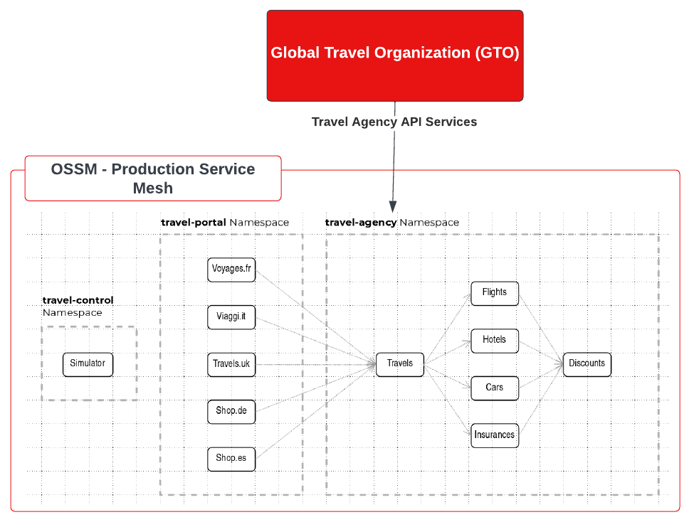
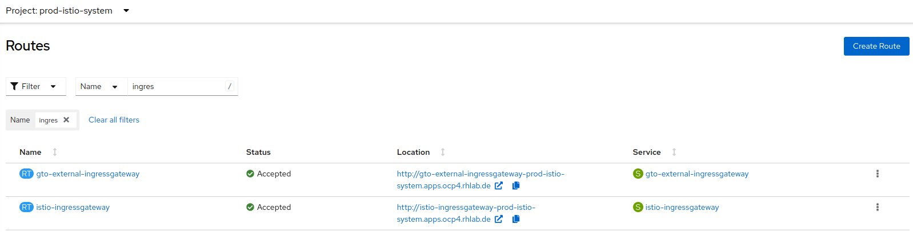
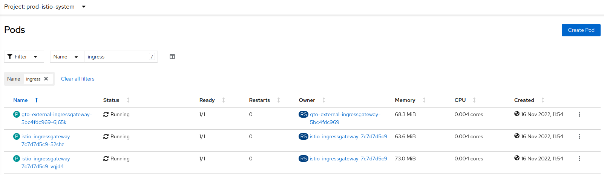
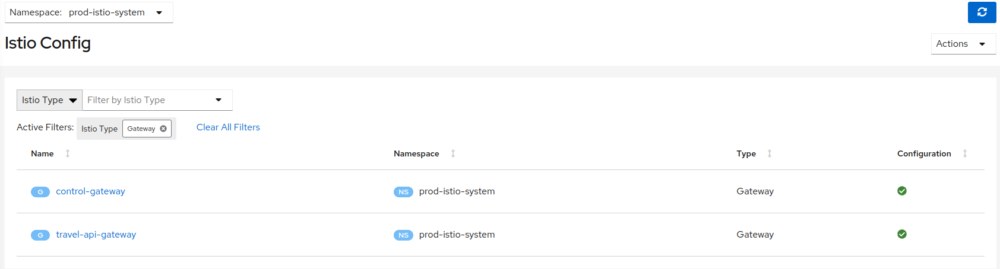
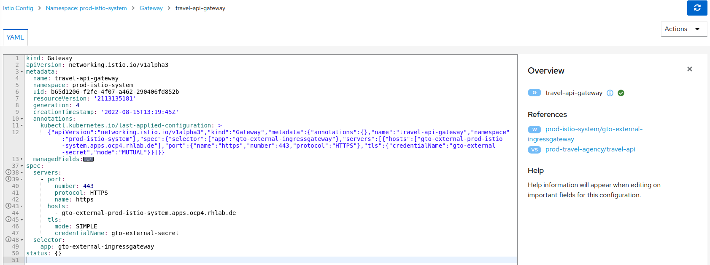
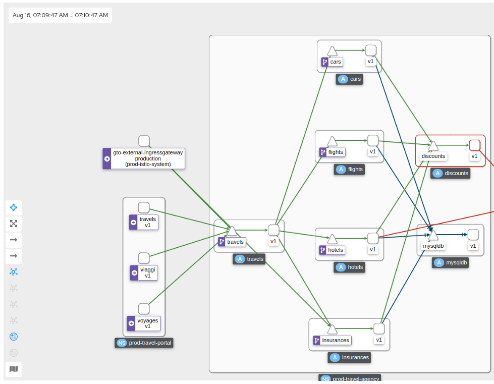
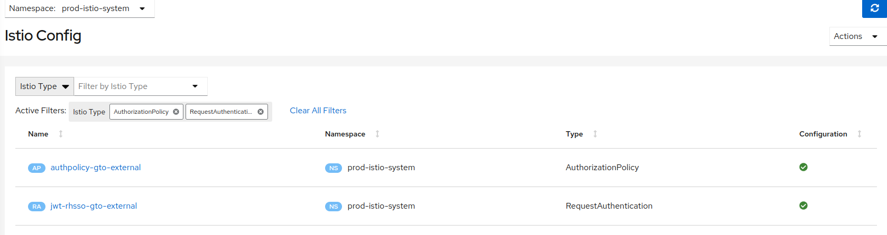
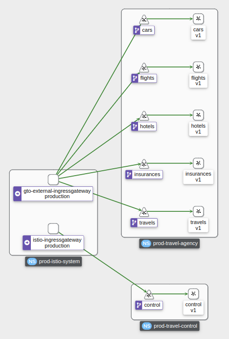

= New Business Opportunity: Onboarding an external travel portal to existing travel-agency
:toc:

[NOTE]
====
All actions to reference a Role to be done under
====

== Requirements focused on new Business Opportunity setup

The `Travel Agency` business development department has managed to strike a new business deal:

1. The _Global Travel Organization(GTO)_ will source travel offers via _Travel Services Domain_ APIs.
2. The _Security Team_ requires all communications with the external client to be performed over `MUTUAL TLS`.
3. The _Platform Team_ wishes to enable further `authentication` with a valid JWT token in order to exercise possible `authorization` policies in the future.

== Configure additional ingress for _Travel Agency API_ Services

* Define URL of the CLUSTER for the users to login at
+
----
export CLUSTER_API=<YOUR-CLUSTER-API-URL>
----

[NOTE]
====
Actions with role `Mesh Operator`
====

* Create Istio `Route`, CA Root keys/certificates, client/server certificates and `Gateway` resource to allow external access of _Travel Domain Services APIs_ authenticated via mTLS.
+
----
cd ossm-heading-to-production-and-day-2/scenario-4-onboard-new-portal-with-authentication
./login-as.sh emma

# Add to SMCP
    additionalIngress:
      gto-external-ingressgateway:
        enabled: true
        runtime:
          deployment:
            autoScaling:
              enabled: false
        service:
          metadata:
            labels:
              app: gto-external-ingressgateway
          selector:
            app: gto-external-ingressgateway

./scripts/create-external-mtls-https-ingress-gateway.sh prod-istio-system <OCP CLUSTER DOMAIN eg. apps.example.com>
----

* The result is a new pod for `gto-external-ingressgateway` is created, a TLS passthrough Route to expose access to it and an Istio config `travel-api-gateway` which defines the MUTUAL TLS requirement and the secret which will contain the certificates and keys.
+

[NOTE]
====
Actions with role `Mesh Developer`
====

* As *farid* (`Mesh Developer`) _Travel Services Domain Owner (Tech Lead)_ deploy the in `prod-travel-agency` namespace Istio Configs to allow requests via the above defined `Gateway` to reach services `cars`, `insurances`, `flights`, `hotels` and `travels`.
+
----
./login-as.sh farid
./scripts/create-client-certs-keys.sh curl-client
./scripts/deploy-external-travel-api-mtls-vs.sh prod prod-istio-system
----
+
The result will be an mTLS handshake between the _GTO_ client and the `Travel Agency APIs` via the newly create `gto-external-ingressgateway`
+
----
curl -v -X GET --cacert ca-root.crt --key curl-client.key --cert curl-client.crt  https://gto-external-prod-istio-system.apps.ocp4.rhlab.de/flights/Tallinn
Note: Unnecessary use of -X or --request, GET is already inferred.
  % Total    % Received % Xferd  Average Speed   Time    Time     Time  Current
                                 Dload  Upload   Total   Spent    Left  Speed
  0     0    0     0    0     0      0      0 --:--:-- --:--:-- --:--:--     0*   Trying 46.4.107.61:443...
* Connected to gto-external-prod-istio-system.apps.ocp4.rhlab.de (46.4.107.61) port 443 (#0)
* ALPN, offering h2
* ALPN, offering http/1.1
* successfully set certificate verify locations:
*  CAfile: ca-root.crt
*  CApath: none
} [5 bytes data]
* TLSv1.3 (OUT), TLS handshake, Client hello (1):
} [512 bytes data]
* TLSv1.3 (IN), TLS handshake, Server hello (2):
{ [122 bytes data]
* TLSv1.3 (IN), TLS handshake, Encrypted Extensions (8):
{ [15 bytes data]
* TLSv1.3 (IN), TLS handshake, Request CERT (13):
{ [180 bytes data]
* TLSv1.3 (IN), TLS handshake, Certificate (11):
{ [2665 bytes data]
* TLSv1.3 (IN), TLS handshake, CERT verify (15):
{ [264 bytes data]
* TLSv1.3 (IN), TLS handshake, Finished (20):
{ [52 bytes data]
* TLSv1.3 (OUT), TLS change cipher, Change cipher spec (1):
} [1 bytes data]
* TLSv1.3 (OUT), TLS handshake, Certificate (11):
} [2577 bytes data]
* TLSv1.3 (OUT), TLS handshake, CERT verify (15):
} [264 bytes data]
* TLSv1.3 (OUT), TLS handshake, Finished (20):
} [52 bytes data]
* SSL connection using TLSv1.3 / TLS_AES_256_GCM_SHA384
* ALPN, server accepted to use h2
* Server certificate:
*  subject: C=UK; ST=London; L=London; O=RedHat; CN=gto-external-prod-istio-system.apps.ocp4.rhlab.de
*  start date: Aug 15 13:45:42 2022 GMT
*  expire date: Aug 15 13:45:42 2023 GMT
*  common name: gto-external-prod-istio-system.apps.ocp4.rhlab.de (matched)
*  issuer: C=UK; ST=London; L=London; OU=stelios; CN=redhat.com; emailAddress=stelios@redhat.com
*  SSL certificate verify ok.
* Using HTTP2, server supports multiplexing
* Connection state changed (HTTP/2 confirmed)
* Copying HTTP/2 data in stream buffer to connection buffer after upgrade: len=0
} [5 bytes data]
* Using Stream ID: 1 (easy handle 0x556f26662ee0)
} [5 bytes data]
> GET /flights/Tallinn HTTP/2
> Host: gto-external-prod-istio-system.apps.ocp4.rhlab.de
> user-agent: curl/7.79.1
> accept: */*
>
{ [5 bytes data]
* TLSv1.3 (IN), TLS handshake, Newsession Ticket (4):
{ [1337 bytes data]
* TLSv1.3 (IN), TLS handshake, Newsession Ticket (4):
{ [1337 bytes data]
* old SSL session ID is stale, removing
{ [5 bytes data]
* Connection state changed (MAX_CONCURRENT_STREAMS == 2147483647)!
} [5 bytes data]
< HTTP/2 200
< content-type: application/json
< date: Mon, 15 Aug 2022 13:58:58 GMT
< content-length: 123
< x-envoy-upstream-service-time: 19
<
{ [123 bytes data]
100   123  100   123    0     0    471      0 --:--:-- --:--:-- --:--:--   473
* Connection #0 to host gto-external-prod-istio-system.apps.ocp4.rhlab.de left intact
[
  {
    "airline": "Red Airlines",
    "price": 1008
  },
  {
    "airline": "Blue Airlines",
    "price": 358
  },
  {
    "airline": "Green Airlines",
    "price": 308
  }
]
----
+

== Use JWT authentication

The intended final workflow of authentication for the `GTO` requests with a `JWT` token is as follows (*Note:* this is in addition to the mTLS handshake):

0. the user authenticates to RHSSO and get a JWT token (not shown in the above picture);
1. the user performs an HTTP request to `https://<route>/travels` (or one of `cars`, `hotels`, `insurances`, `flights`) and passes along this request the JWT token;
3. The 'istio-proxy' container of the 'gto-external-ingressgateway' POD checks the validity of the JWT token as defined by the 'RequestAuthentication' object and permissions defined in the 'AuthorizationPolicy' object.
4. if the JWT token is valid, user accesses the `/PATH` - otherwise, an error message is returned to the user (code `403`, message `RBAC denied` or others).

* Pros:
** the simplest approach (only 2 CR to be deployed)
** fine-grained authorization based on JWT token fields
* Cons:
** no OIDC workflow: the user must get a JWT token on its own, and pass it with the HTTP request on its own
** need to define `RequestAuthentication` and `AuthorizationPolicy` objects for each application to protect inside the service mesh

=== Setup Red Hat Signle Sign-On Server (RHSSO)

[NOTE]
====
Actions with role `Cluster Admin`
====

* Complete pre-requisites (*NOTE:* if you don't have `sed` utility in your path you need to perform the replacement by hand)
----
./login-as.sh phillip
./prerequisites-setup.sh <CLUSTERNAME> <BASEDOMAIN> (eg.for apps.ocp4.example.com  'prerequisites-setup.sh ocp4 example.com)
----

=== Mount RHSSO TLS Certificate to Istiod

[NOTE]
====
Actions with role `Cluster Admin`
====

* Mount Openshift ingress routers CA certificate in istiod. When deploying `RequestAuthentication` object,
Istiod will be in charge of verifying the connection to RHSSO. This step is performed during initialization only
(`RequestAuthentication` object creation). Since RHSSO is exposed behind a route, we need to add the Openshift
ingress routers CA certificate to istiod so it can verify the TLS certificate for the RHSSO route.
----
./login-as.sh phillip
./scripts/mount-rhsso-cert-to-istiod.sh prod-istio-system production <CLUSTERNAME> <BASEDOMAIN>
----

=== Create `RequestAuthentication` and `AuthorizationPolicy` to ALLOW access for `gto-external` user `gtouser`

* The created `RequestAuthentication` object enforces in `Istio` that only _JWT_ tokens issued by the RHSSO will be used to
authenticate/authorize user requests for `cars`, `travels`, `hotels`, `insurances` and `flights`.
* The created `AuthenticationPolicy` object has the effect that in order fo a _JWT_ token, to be valid, must be issued by our RHSSO (During prerequisites phase, we created a user localuser inside RHSSO, and this user has the address gtouser@gto.com).

[NOTE]
====
Actions with role `Mesh Operator`
====

* As these are applied on the newly create `gto-external-ingressgateway` in `prod-istio-system` it will be applied by *emma* the Mesh Operator
----
./login-as.sh emma
oc -n prod-istio-system apply -f approach_1/yaml/istio/jwt/01_requestauthentication.yaml
oc -n prod-istio-system apply -f approach_1/yaml/istio/jwt/02_authpolicy_allow_from_servicemesh-lab_realm.yaml
----
* The result will be for any request coming in via `gto-external` Route and then hitting the `gto-external-ingressgateway` to be intercepted and required to contain beyond the TLS certificate for `mTLS` on the `Gateway` an additional `JWT` valid token before the request is allowed to proceed.
+

=== Access `gto-external` exposed _Travel Agency APIs_ with JWT

* First, ensure that you cannot access anymore the `travels`, `cars` applications without a valid `JWT` token (it might take a few seconds for the changes to apply)
+
----
export GATEWAY_URL=$(oc -n prod-istio-system get route gto-external -o jsonpath='{.spec.host}')
curl -v -X GET --cacert ca-root.crt --key curl-client.key --cert curl-client.crt https://$GATEWAY_URL/cars/Tallinn |jq
curl -v -X GET --cacert ca-root.crt --key curl-client.key --cert curl-client.crt https://$GATEWAY_URL/travels/Tallinn |jq
curl -v -X GET --cacert ca-root.crt --key curl-client.key --cert curl-client.crt https://$GATEWAY_URL/flights/Tallinn |jq
curl -v -X GET --cacert ca-root.crt --key curl-client.key --cert curl-client.crt https://$GATEWAY_URL/insurances/Tallinn |jq
curl -v -X GET --cacert ca-root.crt --key curl-client.key --cert curl-client.crt https://$GATEWAY_URL/hotels/Tallinn  |jq

HTTP/1.1 403 Forbidden
----

* Retrieve a JWT token for user gtouser from RHSSO and use that during _Travel Agency API_ calls
** Note: the <CLIENT_SECRET> must be replaced with the client secret of the RHSSO client created during prerequisites phase (see link:prerequisites/yaml/rhsso/03_istio-client.yaml[03_istio-client.yaml]).
+
----
TOKEN=$(curl -Lk --data "username=gtouser&password=gtouser&grant_type=password&client_id=istio&client_secret=<CLIENT_SECRET>" \
https://keycloak-rhsso.apps.<CLUSTERNAME>.<BASEDOMAIN>/auth/realms/servicemesh-lab/protocol/openid-connect/token \
| jq .access_token)

echo $TOKEN
----

* Finally, use this JWT token to access as `GTO` user the _Travel Agency APIs_
+
----
./scripts/call-via-mtls-and-jwt-travel-agency-api.sh prod-istio-system gto-external $TOKEN
----
+

IMPORTANT: Next in link:../scenario-5-new-regulations-mtls-everywhere/README.adoc[Scenario-5] Help the Travel to Harden security with Corporate CA and Authorization Policies

