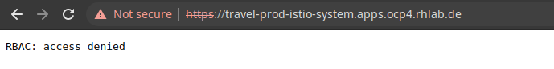
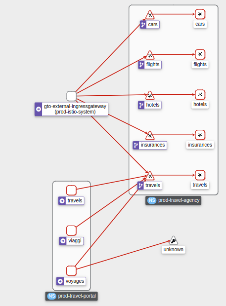
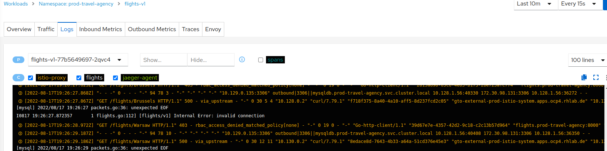
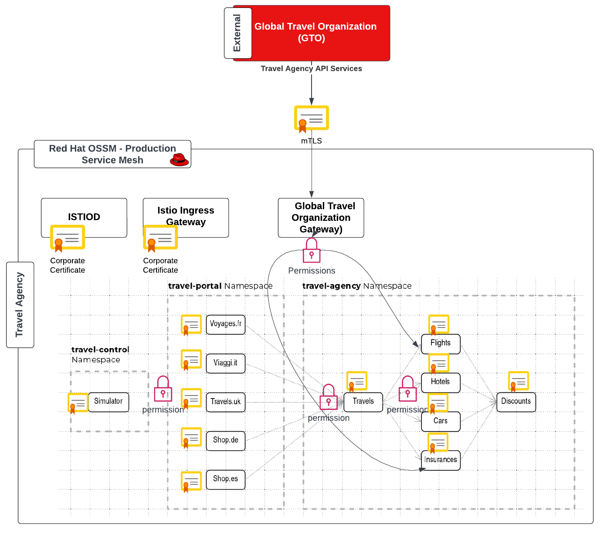

= New regulation to secure all information
:toc:

[[requirements]]
== Requirements focused on Authorization and Corporate Security setup

The requirements below is a refinement, based on further analysis with the Security and Product Teams, of the _Security_ functional requirements:

1. The _Security Team_ requires a corporate (intermmediate) CA to be used for the generation of the certificates used in _intramesh_ Service Mesh _mTLS_ communications.
2. The _Product Team_ (of the _Travel Agency APIs_) requires to add authorization for the access to specific services.

[NOTE]
====
All actions to reference a Role to be done under
====

== Implement mTLS across all services

The aim is to enhance the _Service Mesh to generate and rotate the _intramesh_ `mTLS` certificates based on a corporate CA and intermediate CA.

* We will create the certificates, keys, certificate chain and add it to the `production` SMCP resource.
* Validate it is actually applied
* What if I want one service to be excluded from `OSSM` *mTLS*?

=== Create Corporate CA and Certificate for intramesh `mTLS` for Production

[NOTE]
====
Actions with role `Cluster Admin`
====

----
cd ossm-heading-to-production-and-day-2/scenario-5-new-regulations-mtls-everywhere
----

* Follow the link:README-create-ca-root-and-intermediate-key-certs.adoc[instructions] to create CA root, intermmediate keys and certificates and a chain certificate. Once done you should have as follows and then you need to add them to a secret:

----
.
├── certs
│   └── ca.cert.pem
├── crl
├── csr
├── index.txt
├── index.txt.attr
├── index.txt.old
├── intermediate
│   ├── certs
│   │   ├── ca-chain.cert.pem
│   │   └── intermediate.cert.pem
│   ├── crl
│   ├── crlnumber
│   ├── csr
│   │   └── intermediate.csr.pem
│   ├── index.txt
│   ├── newcerts
│   ├── openssl.cnf
│   ├── private
│   │   └── intermediate.key.pem
│   └── serial
├── newcerts
│   └── 1000.pem
├── openssl.cnf
├── private
│   └── ca.key.pem
├── serial
└── serial.old
----

=== Modify the `production` SMCP tenant to use the corporate based CA, Intermediate CA and chain certificates

[NOTE]
====
Actions with role `Mesh Operator`
====

* Firstly, verify the current `controlplane` and `dataplane` used certificates are issued by `Issuer: O = cluster.local`
** Check the issuer of the default service mesh certificate (it should be something like `Issuer: O = cluster.local`)
+
----
./login-as.sh emma
oc get -o yaml secret istio-ca-secret -n prod-istio-system | grep ca-cert | awk '{print $2}' | base64 -d | openssl x509 -noout -text
----

** Checking the certificates used in the communication with `istiod`, the Issuer is again `issuer=O = cluster.local`
+
----
./login-as.sh emma
oc exec "$(oc get pod -l app=istio-ingressgateway -n prod-istio-system -o jsonpath={.items..metadata.name})" -c istio-proxy -n prod-istio-system -- openssl s_client -showcerts -connect $(oc get svc istiod-production -o jsonpath={.spec.clusterIP}):15012
----

** Checking the certificates used in the POD to POD communications, the Issuer is again `issuer=O = cluster.local`
+
----
./login-as.sh emma
oc exec "$(oc get pod -l app=hotels -n prod-travel-agency -o jsonpath={.items..metadata.name})" -c istio-proxy -n prod-travel-agency -- openssl s_client -showcerts -connect $(oc get svc discounts -o jsonpath={.spec.clusterIP}):8000
----

* The link:https://docs.openshift.com/container-platform/4.11/service_mesh/v2x/ossm-security.html#ossm-cert-manage-add-cert-key_ossm-security[documentation] instructs to create a secret named `cacert` that includes the input files `ca-cert.pem`, `ca-key.pem`, `root-cert.pem` and `cert-chain.pem`. Based on the files you generated the equivalent are:
** `intermediate.cert.pem` (`ca-cert.pem`). the certificate for the intermediate ca
** `intermediate.key.pem` (`ca-key.pem`). the key for the intermediate ca certificate
** `ca.cert.pem` (`root-cert.pem`): the root ca certificate
** `ca-chain.cert.pem` (`cert-chain.pem`)the certificate chain that includes both certificates

----
./login-as.sh emma
oc create secret generic cacerts -n prod-istio-system \
  --from-file=ca-cert.pem=certs-resources/intermediate/certs/intermediate.cert.pem \
  --from-file=ca-key.pem=certs-resources/intermediate/private/intermediate.key.pem \
  --from-file=root-cert.pem=certs-resources/certs/ca.cert.pem \
  --from-file=cert-chain.pem=certs-resources/intermediate/certs/ca-chain.cert.pem
----

* Remove the `istio-system-ca` secret created as default CA by `OSSM` as we have found it interferes with the `istiod` correctly picking the enterprise certificates from the newly created `cacerts` secret

----
./login-as.sh emma
oc get  secret istio-ca-secret -n prod-istio-system -o yaml > istio-ca-secret-default.yaml
oc delete secret istio-ca-secret -n prod-istio-system
----

* Add to the `ServiceMeshControlPlane` resource `production` under `certificateAuthority` field as shown in the following example.  Service Mesh reads the certificates and key from the secret-mount files.

----
./login-as.sh emma

# Add in production SMCP
  security:
    certificateAuthority:
      type: Istiod
      istiod:
        type: PrivateKey
        privateKey:
          rootCADir: /etc/cacerts
----

=== Restart `controlplane` and `dataplane` resources to force new certificate utilization

* After adding the corporate the certificates, the control plane `istiod` and `gateway` pods must be restarted so the changes go into effect. Use the following command to restart the pods(The Operator will automatically recreate the pods after they have been deleted):
+
----
./login-as.sh emma
oc -n prod-istio-system delete pods -l 'app in (istiod,istio-ingressgateway, istio-egressgateway,gto-external-ingressgateway)'
oc -n prod-istio-system get -w pods
----

* Restart the `dataplane` pods to expedite the sidecar proxies picking up the secret changes.
+
----
./login-as.sh emma
oc -n prod-travel-control delete pods --all
oc -n prod-travel-agency delete pods --all
oc -n prod-travel-portal delete pods --all
----

* Identify the `cacerts` Issuer (it should be `Issuer: C = GB, ST = England, L = London, O = Travel Agency Ltd, OU = Travel Agency Ltd Certificate Authority, CN = Travel Agency Ltd Root CA`) 
+
----
./login-as.sh emma
oc get -o yaml secret cacerts -n prod-istio-system | grep ca-cert | awk '{print $2}' | base64 -d | openssl x509 -noout -text
----

* Verify the `dataplane` communications are secured with the new corporate certificates
+
----
./login-as.sh emma
./verify-dataplane-certs.sh

###########################
 CERTS CHECK ON DATAPLANE
###########################

1. Sleep 20 seconds for the mTLS policy to take effect before retrieving the certificate chain of cars POD. As the CA certificate used in this example is self-signed, the verify error:num=19:self signed certificate in certificate chain error returned by the openssl command is expected.
------------------------------------------------------
Can't use SSL_get_servername
depth=2 C = GB, ST = England, L = London, O = Travel Agency Ltd, OU = Travel Agency Ltd Certificate Authority, CN = Travel Agency Ltd Root CA
verify error:num=19:self signed certificate in certificate chain
verify return:1
depth=2 C = GB, ST = England, L = London, O = Travel Agency Ltd, OU = Travel Agency Ltd Certificate Authority, CN = Travel Agency Ltd Root CA
verify return:1
depth=1 C = GB, ST = England, O = Travel Agency Ltd, OU = Travel Agency Ltd Certificate Authority, CN = Travel Agency Ltd Intermediate CA
verify return:1
depth=0 
verify return:1
DONE

2. Parse the certificates on the certificate chain.
------------------------------------------------------

3. Verify the root certificate used in the POD handshake is the same as the one specified by the OSSM administrator:
------------------------------------------------------
Files /tmp/root-cert.crt.txt and /tmp/pod-root-cert.crt.txt are identical

4. Verify the Intermediate CA certificate used in the POD handshake is the same as the one specified by the OSSM administrator:
------------------------------------------------------
Files /tmp/ca-cert.crt.txt and /tmp/pod-cert-chain-ca.crt.txt are identical

5. Verify the certificate chain from the root certificate to the workload certificate:
------------------------------------------------------
./proxy-cert-1.pem: OK
----

* Verify the `controlplane` communications are secured with the new corporate certificates
+
----
./login-as.sh emma
./verify-controlplane-certs.sh

###########################
CERTS CHECK ON CONTROLPLANE
###########################

1. Get the ceritificates used between istio-ingressgateway and istiod
Can't use SSL_get_servername
depth=2 C = GB, ST = England, L = London, O = Travel Agency Ltd, OU = Travel Agency Ltd Certificate Authority, CN = Travel Agency Ltd Root CA
verify error:num=19:self signed certificate in certificate chain
verify return:1
depth=2 C = GB, ST = England, L = London, O = Travel Agency Ltd, OU = Travel Agency Ltd Certificate Authority, CN = Travel Agency Ltd Root CA
verify return:1
depth=1 C = GB, ST = England, O = Travel Agency Ltd, OU = Travel Agency Ltd Certificate Authority, CN = Travel Agency Ltd Intermediate CA
verify return:1
depth=0 
verify return:1
DONE

2. Verify the root certificate used in the istiod handshake is the same as the one specified by the OSSM administrator:
------------------------------------------------------
Files /tmp/root-cert.crt.txt and /tmp/pod-root-cp-cert.crt.txt are identical

4. Verify the Intermediate CA certificate used in the istiod handshake is the same as the one specified by the OSSM administrator:
------------------------------------------------------
Files /tmp/ca-cert.crt.txt and /tmp/pod-cert-cp-chain-ca.crt.txt are identical

5. Verify the certificate chain from the root certificate to the workload certificate:
------------------------------------------------------
./proxy-cp-cert-1.pem: OK
----

=== Testing with mtls `STRICT` and `DISABLE` services

Sometimes (see KAFKA, Elastic Search) the workloads that are in the Service Mesh may opt to offer their own mTLS certificates or no mTLS. Here we showcase how to include/exclude for mTLS the workloads in the mesh.

* Verify that `STRICT` mtls between ALL services is enabled in the service mesh.
+
----
oc get peerauthentication -n prod-istio-system
NAME                            MODE         AGE
default                         STRICT       60d
disable-mtls-jaeger-collector   DISABLE      60d
grafana-ports-mtls-disabled     PERMISSIVE   60d
----

** Check the mTLS handshake between `travels` and `cars` services.
+
----
oc exec "$(oc get pod -l app=travels -n prod-travel-agency -o jsonpath={.items..metadata.name})" -c istio-proxy -n prod-travel-agency -- openssl s_client -showcerts -connect $(oc -n prod-travel-agency get svc cars -o jsonpath={.spec.clusterIP}):8000
----

* `DISABLE` mTLS for the 
+
----
echo "apiVersion: security.istio.io/v1beta1
kind: PeerAuthentication
metadata:
  name: cars-mtls-disable
  namespace: prod-travel-agency
spec:
  selector:
    matchLabels:
      app: cars
  mtls:
    mode: DISABLE"|oc apply -f -
----

** Check that *no mTLS handshake* is now taking place between `travels` and `cars` services.
+
----
oc exec "$(oc get pod -l app=travels -n prod-travel-agency -o jsonpath={.items..metadata.name})" -c istio-proxy -n prod-travel-agency -- openssl s_client -showcerts -connect $(oc -n prod-travel-agency get svc cars -o jsonpath={.spec.clusterIP}):8000

CONNECTED(00000003)
---
no peer certificate available
---
No client certificate CA names sent
---
SSL handshake has read 5 bytes and written 289 bytes
Verification: OK
---
New, (NONE), Cipher is (NONE)
Secure Renegotiation IS NOT supported
Compression: NONE
Expansion: NONE
No ALPN negotiated
Early data was not sent
Verify return code: 0 (ok)
---
140624032003904:error:1408F10B:SSL routines:ssl3_get_record:wrong version number:ssl/record/ssl3_record.c:332:
command terminated with exit code 1
----

* Remove `peerAuthentication`
+
----
oc delete peerauthentication cars-mtls-disable
----

== Implement new authz policies

The _Travel Agency_ like any business requires fine-grained _authorization_ policies to be applied. A _Service Mesh_ provides the capability to externalize this policies from the actual service code and the _Travel Agency_  mesh operator and product domain personnel below will implement them restricting access based on _Best Practices_ and business requirements.

Further authorization capabilities are described in the `Istio` link:https://istio.io/latest/docs/tasks/security/authorization/[authorization documentation].

=== _Service Mesh_ default Authz policy is `ALLOW` all communications

* First lets verify that by default the _Service Mesh_ authorization policies allows all communications. The following table determines the expected ALLOWed communications.

[cols="1,1,3,1,4"]
.Default policy is ALLOW all
|===
| Type of Policy | Namespaces | Client | Target | Test

| ALLOW all | `prod-istio-system` -> `prod-travel-control` | Browser | `control.prod-travel-control` | `https://travel-prod-istio-system.apps.<CLUSTERNAME>.<BASEDOMAIN>/`

| ALLOW all | `prod-istio-system` -> `prod-travel-agency` | `gto-external-ingressgateway` | `travels.prod-travel-agency`, `flights.prod-travel-agency`, `hotels.prod-travel-agency`, `insurances.prod-travel-agency`, `cars.prod-travel-agency` | see SCRIPT below

| ALLOW all | `prod-travel-control` -> `prod-travel-agency` | `control.prod-travel-control` | `travels.prod-travel-agency`, `flights.prod-travel-agency`, `hotels.prod-travel-agency`, `insurances.prod-travel-agency`, `cars.prod-travel-agency` | see SCRIPT below

| ALLOW all | `prod-travel-portal` -> `prod-travel-agency` | `viaggi.prod-travel-portal` | `travels.prod-travel-agency`, `flights.prod-travel-agency`, `hotels.prod-travel-agency`, `insurances.prod-travel-agency`, `cars.prod-travel-agency` | see SCRIPT below

| ALLOW all | `prod-travel-agency` -> `prod-travel-agency` | `travels.prod-travel-agency` | `travels.prod-travel-agency`, `flights.prod-travel-agency`, `hotels.prod-travel-agency`, `insurances.prod-travel-agency`, `cars.prod-travel-agency` | see SCRIPT below

|===

* Verify existing default policy by executing the script and compare the expected output

----
./scripts/check-authz-all.sh ALLOW prod-istio-system <CLUSTERNAME> <BASEDOMAIN> <CERTS_LOCATION> (CERTS_LOCATION ../scenario-4-onboard-new-portal-with-authentication)

####################################################################
#                                                                  #
#           CHECKING ALLOW ALL AUTHZ DEFAULT POLICY                #
#                                                                  #
####################################################################

Authorization prod-istio-system --> prod-travel-agency
-------------------------------------------------------------------
[ALLOW] gto-external-ingressgateway --> travels.prod-travel-agency
[ALLOW] gto-external-ingressgateway --> cars.prod-travel-agency
[ALLOW] gto-external-ingressgateway --> flights.prod-travel-agency
[ALLOW] gto-external-ingressgateway --> insurances.prod-travel-agency
[ALLOW] gto-external-ingressgateway --> hotels.prod-travel-agency

Authorization prod-travel-control --> prod-travel-agency
-------------------------------------------------------------------
[ALLOW] control.prod-travel-control --> travels.prod-travel-agency
[ALLOW] control.prod-travel-control --> cars.prod-travel-agency
[ALLOW] control.prod-travel-control --> flights.prod-travel-agency
[ALLOW] control.prod-travel-control --> insurances.prod-travel-agency
[ALLOW] control.prod-travel-control --> hotels.prod-travel-agency

Authorization prod-travel-portal --> prod-travel-agency
-------------------------------------------------------------------
[ALLOW] viaggi.prod-travel-portal --> travels.prod-travel-agency
[ALLOW] viaggi.prod-travel-portal --> cars.prod-travel-agency
[ALLOW] viaggi.prod-travel-portal --> flights.prod-travel-agency
[ALLOW] viaggi.prod-travel-portal --> insurances.prod-travel-agency
[ALLOW] viaggi.prod-travel-portal --> hotels.prod-travel-agency

Authorization prod-travel-agency --> prod-travel-agency
-------------------------------------------------------------------
[ALLOW] travels.prod-travel-portal --> discounts.prod-travel-agency
[ALLOW] travels.prod-travel-portal --> cars.prod-travel-agency
[ALLOW] travels.prod-travel-portal --> flights.prod-travel-agency
[ALLOW] travels.prod-travel-portal --> insurances.prod-travel-agency
[ALLOW] travels.prod-travel-portal --> hotels.prod-travel-agency
----

=== Apply `DENY ALL` best practice pattern

* It is `Istio` Security Best Practice and _Safer Authorization Policy Patterns_ to use the link:https://istio.io/latest/docs/ops/best-practices/security/#use-default-deny-patterns[`default-deny` pattern].

[NOTE]
====
Actions with role `Mesh Developer`
====

* In the previous link:https://gitlab.consulting.redhat.com/servicemesh-in-action/ossm-heading-to-production-and-day-2/-/blob/main/scenario-4-onboard-new-portal-with-authentication/README.adoc#user-content-create-requestauthentication-and-authorizationpolicy-to-allow-access-for-gto-external-user-gtouser[scenario-4] we applied an `AuthorizationPolicy` resource (`authpolicy-gto-external`) which allows requests flowing via the `gto-external-ingressgateway`. Now, we will utilize the `default-deny` pattern to DENY requests unless there is a specific `AuthorizationPolicy` allowing it.
** As *emma* (`Mesh Operator`) apply the `default-deny` pattern to the in the `prod-travel-control` and `prod-travel-agency` namespace.
+
----
cd ossm-heading-to-production-and-day-2/scenario-5-new-regulations-mtls-everywhere
./login-as.sh emma
oc apply -f authz-resources/01-default-deny.yaml
----

* We can verify that now no communications from the _Service Mesh_ are authorizated towards the _Travel Agency API_ Services or the _Travel Portal_.
+
[cols="1,1, 2,6,1"]
.DENY ALL policy
|===
| Type of Policy | Namespaces | Client | Target | Test

| DENY all | `prod-istio-system` -> `prod-travel-control` | Browser | `https://travel-prod-istio-system.apps.ocp4.rhlab.de/` | `https://travel-prod-istio-system.apps.<CLUSTERNAME>.<BASEDOMAIN>/` (see screenshot below)

| DENY all | `prod-istio-system` -> `prod-travel-agency` | `gto-external-ingressgateway` | `travels.prod-travel-agency`, `flights.prod-travel-agency`, `hotels.prod-travel-agency`, `insurances.prod-travel-agency`, `cars.prod-travel-agency` | see SCRIPT below

| DENY all | `prod-travel-control` -> `prod-travel-agency` | `control.prod-travel-control` | `travels.prod-travel-agency`, `flights.prod-travel-agency`, `hotels.prod-travel-agency`, `insurances.prod-travel-agency`, `cars.prod-travel-agency` | see SCRIPT below

| DENY all | `prod-travel-portal` -> `prod-travel-agency` | `viaggi.prod-travel-portal` | `travels.prod-travel-agency`, `flights.prod-travel-agency`, `hotels.prod-travel-agency`, `insurances.prod-travel-agency`, `cars.prod-travel-agency` | see SCRIPT below

| DENY all | `prod-travel-agency` -> `prod-travel-agency` | `travels.prod-travel-agency` | `travels.prod-travel-agency`, `flights.prod-travel-agency`, `hotels.prod-travel-agency`, `insurances.prod-travel-agency`, `cars.prod-travel-agency` | see SCRIPT below

|===
+
** Check via the browser `https://travel-prod-istio-system.apps.<CLUSTERNAME>.<BASEDOMAIN>/` the outcome should be as follows
+

** Verify default policy is now `DENY` by executing the script and compare the expected output
+
----
./scripts/check-authz-all.sh DENY prod-istio-system <CLUSTERNAME> <BASEDOMAIN> <CERTS_LOCATION> (CERTS_LOCATION ../scenario-4-onboard-new-portal-with-authentication)

####################################################################
#                                                                  #
#           CHECKING DENY ALL AUTHZ DEFAULT POLICY                 #
#                                                                  #
####################################################################

Authorization prod-istio-system --> prod-travel-agency
-------------------------------------------------------------------
[DENY] gto-external-ingressgateway --> travels.prod-travel-agency
[DENY] gto-external-ingressgateway --> cars.prod-travel-agency
[DENY] gto-external-ingressgateway --> flights.prod-travel-agency
[DENY] gto-external-ingressgateway --> insurances.prod-travel-agency
[DENY] gto-external-ingressgateway --> hotels.prod-travel-agency

Authorization prod-travel-control --> prod-travel-agency
-------------------------------------------------------------------
[DENY] control.prod-travel-control --> travels.prod-travel-agency
[DENY] control.prod-travel-control --> cars.prod-travel-agency
[DENY] control.prod-travel-control --> flights.prod-travel-agency
[DENY] control.prod-travel-control --> insurances.prod-travel-agency
[DENY] control.prod-travel-control --> hotels.prod-travel-agency

Authorization prod-travel-portal --> prod-travel-agency
-------------------------------------------------------------------
[DENY] viaggi.prod-travel-portal --> travels.prod-travel-agency
[DENY] viaggi.prod-travel-portal --> cars.prod-travel-agency
[DENY] viaggi.prod-travel-portal --> flights.prod-travel-agency
[DENY] viaggi.prod-travel-portal --> insurances.prod-travel-agency
[DENY] viaggi.prod-travel-portal --> hotels.prod-travel-agency

Authorization prod-travel-agency --> prod-travel-agency
-------------------------------------------------------------------
[DENY] travels.prod-travel-portal --> discounts.prod-travel-agency
[DENY] travels.prod-travel-portal --> cars.prod-travel-agency
[DENY] travels.prod-travel-portal --> flights.prod-travel-agency
[DENY] travels.prod-travel-portal --> insurances.prod-travel-agency
[DENY] travels.prod-travel-portal --> hotels.prod-travel-agency
----
** KIALI view will also verify this
+

=== Apply business justified authorization policies

Below the appropriate user applies the `AuthorizationPolicy` based on what access is allowed towards the services for the `Travel Agency` business.

1. As *emma* (`Mesh Operator`) allow access from the default `istio-ingressgateway` towards the _Travel Portal_.
* The `istio-ingressgateway` is set to `ALLOW` calls on any /PATH
* The principal `cluster.local/ns/prod-istio-system/sa/istio-ingressgateway-service-account` will be allowed to make calls to `prod-travel-control` namespace.
+
----
./login-as.sh emma
oc apply -f authz-resources/02-travel-portal-allow.yaml
----
* The result is access to the _Travel Portal_ UI is (within a few seconds) reinstated (try link:https://travel-prod-istio-system.apps.<CLUSTERNAME>.<BASEDOMAIN>/[`https://travel-prod-istio-system.apps.<CLUSTERNAME>.<BASEDOMAIN>/`])

2. As *farid* (`Mesh Operator`) _Travel Services Domain Owner (Tech Lead)_ allow access from `gto-external-ingressgateway` towards `travels.prod-travel-agency`, `hotels.prod-travel-agency`, `cars.prod-travel-agency`, `insurances.prod-travel-agency`, `flights.prod-travel-agency` in order to enable _GTO_ Travel search requests.
* At the `gto-external-ingressgateway` the _authz_ policy is set already to `ALLOW` calls on any /PATH for any external principal (link:https://istio.io/latest/docs/reference/config/security/authorization-policy/#Source[`requestPrincipals[*]`])
* The principal `"cluster.local/ns/prod-istio-system/sa/gto-external-ingressgateway-service-account"` will now be allowed to make calls to `prod-travel-agency` namespace.
+
----
./login-as.sh farid
oc apply -f authz-resources/03-gto-external-travels-to-travel-agency-allow.yaml
----
** Access from `GTO` is allowed (ie. no longer *403* errors) but `connection refused` error received. Why?
+
----
TOKEN=$(curl -Lk --data "username=gtouser&password=gtouser&grant_type=password&client_id=istio&client_secret=bcd06d5bdd1dbaaf81853d10a66aeb989a38dd51" https://keycloak-rhsso.apps.ocp4.rhlab.de/auth/realms/servicemesh-lab/protocol/openid-connect/token | jq .access_token)
../scenario-4-onboard-new-portal-with-authentication/scripts/call-via-mtls-and-jwt-travel-agency-api.sh prod-istio-system gto-external $TOKEN

< HTTP/2 500
...
* Connection #0 to host gto-external-prod-istio-system.apps.ocp4.rhlab.de left intact
{
  "error": "invalid connection"
}
----
** Inspect KIALI and notice `gto-external-ingressgateway` -> `*.prod-travel-agecny` is fine but `flights` to `mysqldb` is not _authorized_. What can we do?
+

3. As *farid* (`Mesh Developer`) _Travel Services Domain Owner (Tech Lead)_ allow intra `prod-travel-agency` communications.
* The principal `"cluster.local/ns/prod-travel-agency/sa/default"` will now also be allowed to make calls to `prod-travel-agency` namespace.
+
----
./login-as.sh farid
oc apply -f authz-resources/04-intra-travel-agency-allow.yaml
----
** All travel searches from `GTO` will now work
+
----
TOKEN=$(curl -Lk --data "username=gtouser&password=gtouser&grant_type=password&client_id=istio&client_secret=bcd06d5bdd1dbaaf81853d10a66aeb989a38dd51" https://keycloak-rhsso.apps.<CLUSTERNAME>.<BASEDOMAIN>/auth/realms/servicemesh-lab/protocol/openid-connect/token | jq .access_token)
../scenario-4-onboard-new-portal-with-authentication/scripts/call-via-mtls-and-jwt-travel-agency-api.sh prod-istio-system gto-external $TOKEN
----
** test intra-namespace communicationss
+
----
./login-as.sh emma
./scripts/check-authz-all.sh 'ALLOW intra' prod-istio-system <CLUSTERNAME> <BASEDOMAIN> <CERTS_LOCATION> (CERTS_LOCATION ../scenario-4-onboard-new-portal-with-authentication)

####################################################################
#                                                                  #
#           CHECKING ALLOW intra ALL AUTHZ DEFAULT POLICY          #
#                                                                  #
####################################################################

Authorization prod-istio-system --> prod-travel-agency
-------------------------------------------------------------------
[ALLOW] gto-external-ingressgateway --> travels.prod-travel-agency
[ALLOW] gto-external-ingressgateway --> cars.prod-travel-agency
[ALLOW] gto-external-ingressgateway --> flights.prod-travel-agency
[ALLOW] gto-external-ingressgateway --> insurances.prod-travel-agency
[ALLOW] gto-external-ingressgateway --> hotels.prod-travel-agency

Authorization prod-travel-control --> prod-travel-agency
-------------------------------------------------------------------
[DENY] control.prod-travel-control --> travels.prod-travel-agency
[DENY] control.prod-travel-control --> cars.prod-travel-agency
[DENY] control.prod-travel-control --> flights.prod-travel-agency
[DENY] control.prod-travel-control --> insurances.prod-travel-agency
[DENY] control.prod-travel-control --> hotels.prod-travel-agency

Authorization prod-travel-portal --> prod-travel-agency
-------------------------------------------------------------------
[DENY] viaggi.prod-travel-portal --> travels.prod-travel-agency
[DENY] viaggi.prod-travel-portal --> cars.prod-travel-agency
[DENY] viaggi.prod-travel-portal --> flights.prod-travel-agency
[DENY] viaggi.prod-travel-portal --> insurances.prod-travel-agency
[DENY] viaggi.prod-travel-portal --> hotels.prod-travel-agency

Authorization prod-travel-agency --> prod-travel-agency
-------------------------------------------------------------------
[ALLOW] travels.prod-travel-portal --> discounts.prod-travel-agency
[ALLOW] travels.prod-travel-portal --> cars.prod-travel-agency
[ALLOW] travels.prod-travel-portal --> flights.prod-travel-agency
[ALLOW] travels.prod-travel-portal --> insurances.prod-travel-agency
[ALLOW] travels.prod-travel-portal --> hotels.prod-travel-agency
----

4. As *farid* (`Mesh Developer`) _Travel Services Domain Owner (Tech Lead)_ allow communications from `prod-travel-portal` .
* The principal `"cluster.local/ns/prod-travel-portal/sa/default"` will now also be allowed to make calls to `prod-travel-agency` namespace.
+
----
./login-as.sh farid
oc apply -f authz-resources/05-travel-portal-to-travel-agency-allow.yaml
----

=== Non business justified authorization blocked

The application of specific `authz` policies has resulted in restoring the functionality (see below).

image::../images/access-restored-with-authz-policies.png[500,1000]

This does not mean that `ALLOW` all is possible and executing the following shows that `travel-portal-control` still does not have access to `travel-portal-agency`.

----
./login-as.sh emma
./scripts/check-authz-all.sh 'ALLOW intra' prod-istio-system <CLUSTERNAME> <BASEDOMAIN> <CERTS_LOCATION> (CERTS_LOCATION ../scenario-4-onboard-new-portal-with-authentication)
----

=== Apply fine grained `AUTHZ` for external GTO Portal

Finally, the _Travel Agency_ business development department has concluded a business agreement with the _GTO_ which only allows the latter to source `flights` and `insurances` from the _Travel Agency APIs_. As a result the `Authorization Policy` will determine more fine grained access authorization based on this business agreement.

1. As *emma* (`Mesh Operator`) `DENY` communications from `gto-external-ingressgateway` towards any Operation that is link:https://istio.io/latest/docs/reference/config/security/authorization-policy/#Operation[`notPaths`] `/flights` or `/insurances`.
+
----
./login-as.sh emma
oc apply -f authz-resources/06-gto-external-travels-only-flights-insurances-paths-allow.yaml
----
* Checking what is now allowed for `GTO` should yield the following results.
+
----
./login-as.sh emma
./scripts/verify-fine-grained-authz.sh prod-istio-system <CLUSTERNAME> <BASEDOMAIN> <CERTS_LOCATION> (CERTS_LOCATION ../scenario-4-onboard-new-portal-with-authentication)

####################################################################
#                                                                  #
#           VERIFY GTO FINE GRAINED AUTHZ                          #
#               DENY unless /flights/* or /insurances/*            #
#                                                                  #
####################################################################

[DENY] GTO --> /travels
[DENY] GTO --> /cars
[ALLOW] GTO --> /flights
[ALLOW] GTO --> /insurances
[DENY] GTO --> /hotels
----

== The final view of `Authn` and `Authz` setup for the Travel Agency

IMPORTANT: Next in link:../scenario-6-partner-agency-multi-mesh/README.adoc[Scenario-6] Help the Travel Agency to integrate a new Insurance provider via Service Mesh Federation.

== Resources
* https://istio.io/latest/docs/ops/best-practices/security/#use-default-deny-patterns
* https://istio.io/latest/docs/tasks/security/authorization/
* https://istio.io/latest/docs/reference/config/security/conditions/
* https://istio.io/latest/docs/reference/config/security/authorization-policy/#Rule
* https://istio.io/latest/docs/reference/config/security/normalization/
* https://istio.io/latest/docs/ops/best-practices/security/#writing-host-match-policies
* https://istio.io/latest/docs/tasks/security/authorization/authz-custom/
* https://istio.io/latest/docs/concepts/security/#authorization
* https://istio.io/latest/docs/tasks/security/authorization/authz-custom/
* https://docs.openshift.com/container-platform/4.10/service_mesh/v2x/ossm-security.html#ossm-vs-istio_ossm-security
* https://cloud.redhat.com/blog/restricting-user-access-via-service-mesh-2.0-and-red-hat-single-sign-on
