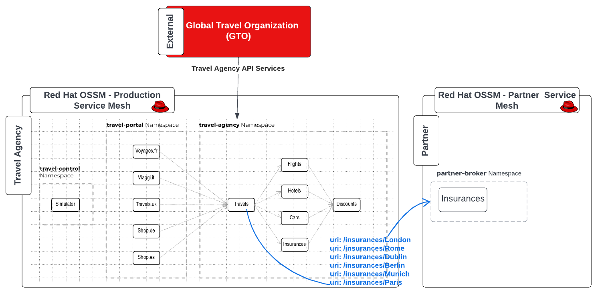
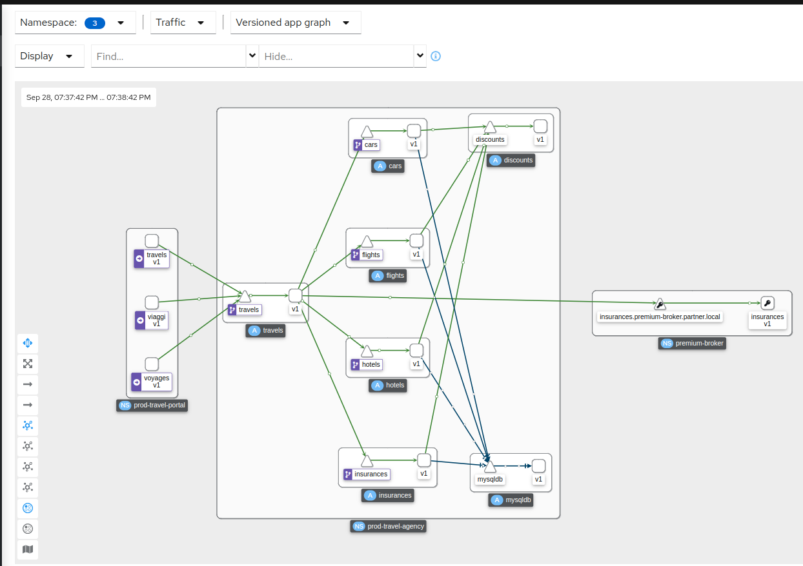
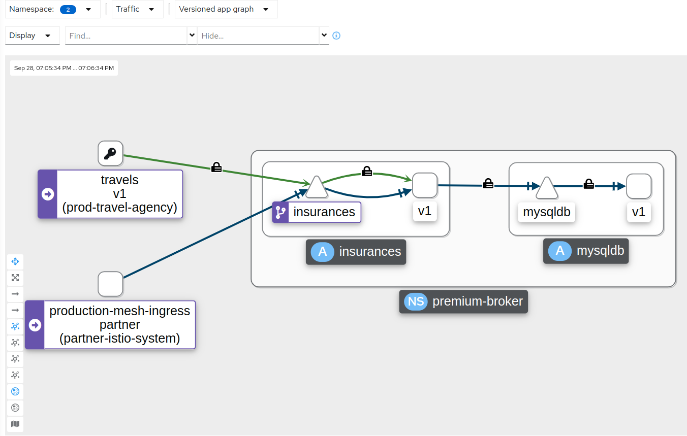
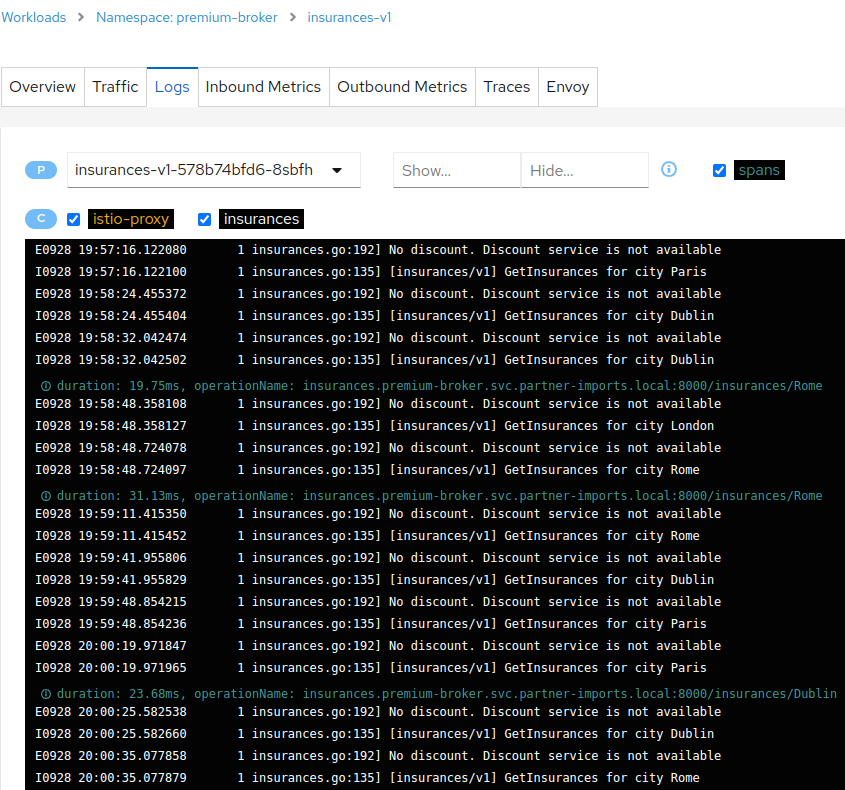
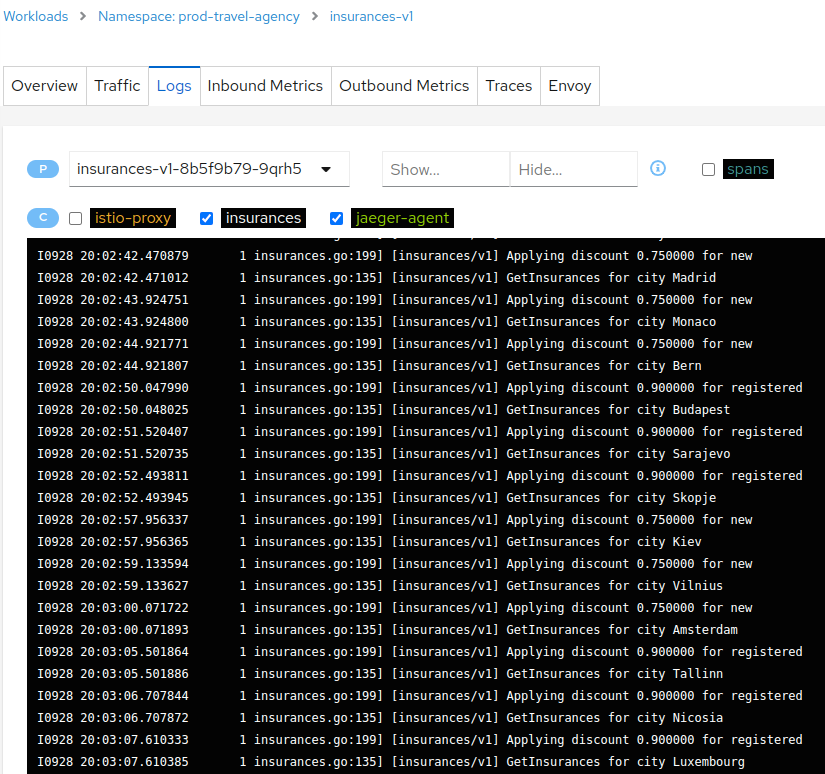

= Expanding partnerships and using a new insurance broker services for specific premium destinations
:toc:

[[requirements]]
== Requirements focused on new Business Partnership setup

The `Travel Agency` has partnered with `Premium Broker` partner to diversify the insurance packages it offers to clients traveling to popular capital destinations.

The requirements below are the business definitions of which insurance requests will be _shifted_ to the partner and security requirements to adhere to.

1. The _Product Team_ (of the _Travel Agency APIs_) requires that all requests for insurance to destinations `London`, `Rome`, `Paris`, `Berlin`, `Munich` and `Dublin` will be forwarded to `Premium Insurance Broker`.
2. The _Security Team_ requires that all communications with the external partner services will adher to _mTLS_ based security.

[NOTE]
====
All actions to reference a Role to be performed under
====

== Deploy the Partner `Premium Broker` Insurance Services

As this is an external, to the `Travel Agency`, system we will perform all actions with *admin* role, however it is expected that similar xref:../scenario-1-kick-off-meeting/README.adoc#map-to-enterprise-personas-with-roles-key-responsibilities-setup[Enterprise Personas] with roles and responsibilities would also exist for the `Premium Insurance Broker`.

* In a single step we will deploy the necessary components for `Premium Broker` Insurance Services
** Deploy a `ServiceMeshControlPlane` `partner` in namespace `partner-istio-system`
** Create a namespace `premium-broker`, add service mesh membership (`SMMR`) for namespace `premium-broker` to `partner` (`SMCP`)
** Deploy `insurance` service in namespace `premium-broker`
** Enable Traffic Routing towards `premium-broker` service `insurance`
** Verify traffic is flowing into it.

[NOTE]
====
Actions with role `Cluster Admin`
====

----
cd ossm-heading-to-production-and-day-2/scenario-6-partner-agency-multi-mesh
./login-as.sh phillip

./create-premium-insurance-broker.sh <PARTNER INSURANCE NAMESPACE> <PARTNER ISTIO CP NAMESPACE> <CLUSTER.DOMAIN eg. apps.ocp4.rhlab.de> <PARTNER SMCP NAME>
./create-premium-insurance-broker.sh premium-broker partner-istio-system <CLUSTER.DOMAIN eg. apps.ocp4.example.com> partner
----

== Routing requests to `Premium Insurance Broker` partner

The next step is to enable at the `Travel Agency` side using Service Mesh capabilities to separate the traffic that is destined for `premium` destinations. We can do this without changing the applications by simply applying one of the following options.

=== Option 1: Non `mTLS` external insurance service call (`ServiceEntry` case without Egress Gateway)

* Apply a `VirtualService` and `DestinationRule` to route traffic for the aforementioned destinations to the remote service location
* Create a `ServiceEntry` for the remote service destination locaion

=== Option 2: Multi-tenancy exercising mTLS without federation, SE, DR to Egress GW, Certs for other SM)

In this solution we would re-direct via the `egress` gateway of the `production` service mesh a call to the remote `premium-broker/insurances` service with the remote certificates shared and applied at `gateway`. An example of such a setup can be explored at link:https://www.wonderingtechie.com/post/2022/ossm-security-with-mtls-for-egress-edge-traffic/[Encrypted External Traffic via egress gateway container].

=== Option 3: Federation between `production` and `partner` mesh

In this final option the 2 `OSSM` instances (`production` and `partner`) will be federated (link:https://docs.openshift.com/container-platform/4.11/service_mesh/v2x/ossm-federation.html#ossm-federation-config-export_federation[federation being a feature of Red Hat `OSSM`] to connect services from multiple mesh instances) and the `insuranceS` service from the `partner` mesh imported and used at the `Travel Agency` for the premium destinations. Below we have implemented this option.

[NOTE]
====
Some important design practices when planning your service mesh federation include:

* Determine how many meshes is required to join in a federation. You probably want to start with a limited number of meshes.
* Decide on the naming convention to use for each mesh as having a pre-defined this will help with configuration and troubleshooting. It is helpful if the naming convention helps to determine who owns and manages each mesh, as well as the following federation resources:
** Cluster names
** Cluster network names
** Mesh names and namespaces
** Federation ingress gateways
** Federation egress gateways
** Security trust domains
====

* The following script in a single step will
** Update the `SMCP` resource `production` to declare 2 additional gateways `partner-mesh-egress` and `partner-mesh-ingress` to connect for federation purposes to Service Mesh `partner`
** Update the `SMCP` resource `partner` to declare 2 additional gateways `production-mesh-egress` and `production-mesh-ingress` to connect for federation purposes to Service Mesh `production`
** Extract from each of the 2 meshes the configmap `istio-ca-root-cert` and share it on the `_controlplane_` namespace of the opposite federated mesh required for the TLS handshake.
** Create `partner` `ServiceMeshPeer` resource in `prod-istio-system` to initiate the peering `production` -> `partner` mesh.
** Create `production` `ServiceMeshPeer` resource in `partner-istio-system` to initiate the peering `partner` -> `production` mesh.
** Export the `insurances` service (via `ExportedServiceSet`) from `premium-broker` namespace and import it (via `ExportedServiceSet`) into `prod-travel-agency` namespace.
+
----
./scripts/option-3-execute-federation-setup.sh <1_SMCP_NAMESPACE> <1_SMCP_NAME> <2_SMCP_NAMESPACE> <2_SMCP_NAME> <PREMIUM NAMESPACE>
./scripts/option-3-execute-federation-setup.sh prod-istio-system production partner-istio-system partner premium-broker
----

The outcome of this configuration will be that insurance quotes requests arriving at `prod-travel-agency/travels` service will be forwarded to federated `insurances.premium-broker.svc.partner-imports.local` service.

* `production` mesh federating requests to imported service `insurances.premium-broker.svc.partner-imports.local`.
+

* `partner` mesh serving requests via exported service `insurances.premium-broker` to `travels-v1.prod-travel-agency` (of `production` mesh).
+

** The logs of the `insurances.premium-broker` POD show that it only serves those premium destinations whilst the `insurances.prod-travel-agency` servers the remaining.
+

+

IMPORTANT: Next in link:../scenario-7-mesh-troubleshooting/README.adoc[Day-2 - Troubleshooting the Mesh Scenario] Help the Travel Agency personnel to establish causes of malfunctions.

== Resources

* link:https://docs.openshift.com/container-platform/4.10/service_mesh/v2x/ossm-federation.html#ossm-federation-config-export_federation[Red Hat Openshift Service Mesh Federation]
* link:https://www.wonderingtechie.com/post/2022/ossm-security-with-mtls-for-egress-edge-traffic/[Red Hat OpenShift Service Mesh (OSSM) - Security options with mTLS for egress edge traffic]
* link:https://www.wonderingtechie.com/post/2022/ossm-federation-scripted/[Red Hat Openshift Service Mesh - Federation Automated Setup]
