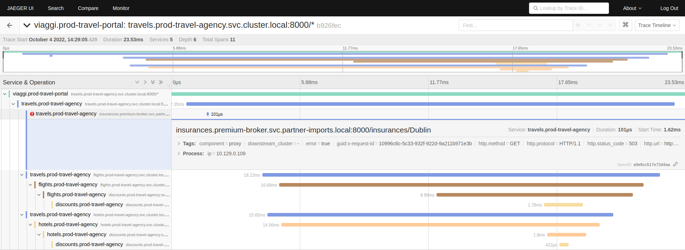
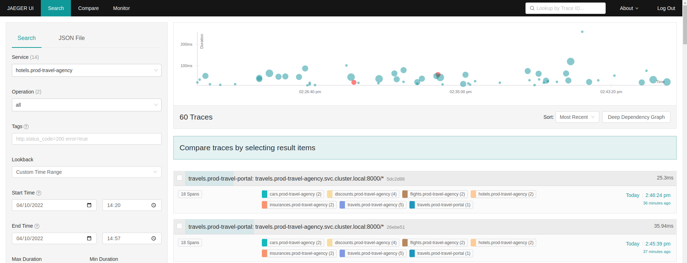
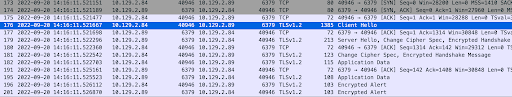

= Troubleshooting the Mesh
:toc:

== Important Troubleshooting questions to ask

In the quest of debugging an Istio network configuration we need to answer some important questions. Some important questions to ask have already been identified [Zack Butcher]:

. Is the Istio network configuration syntactically valid?
. Does the network configuration have an error or warning status set?
. Is the resource name right? Is the resource in the right namespace?
. Are the resource selectors correct?
. Did Envoy accept (ACK) the configuration?
. Did the configuration appear as expected in Envoy?
. Did Istiod (Pilot) log errors?

We would add to those:

. Is the `OSSM` operator and `controlplane` healthy
. Is your application part of the `expected mesh` instance?
. Are the certificates valid

In the following sections we provide guidance on how to identify the answers to these questions and in the process resolve any `Service Mesh` issues.

== Understanding what is involved

In order to identify possible problems in the mesh it is important to be clear on what are the link:https://docs.openshift.com/container-platform/4.11/service_mesh/v2x/ossm-architecture.html[mesh components] and their purpose, their configurations (including where they are applied from), the expected flow of traffic and the tools the `Mesh Operator` and `Application Ops Team` xref:../scenario-1-kick-off-meeting/README.adoc#map-to-enterprise-personas-with-roles-key-responsibilities-setup[personas] can utilize in `production` (or `Mesh Developer` in lower environments) to debug any issues.

As far as components in the mesh we will focus on the following:

. Ingress components (in the preceding examples we have 2 such components `istio-ingressgateway` and `gto-ingressgateway` for `NORTH` inbound client traffic and `partner-mesh-ingress` for federated `WEST` inbound traffic) allowing traffic into the mesh
. Egress components (in the preceding examples we have 2 such component `istio-egressgateway` for `SOUTH` outbound traffic and `partner-mesh-egress` for federated `EAST` outbound traffic) allowing traffic out of the mesh.
. `istio-proxy` sidecar container, for every POD that is part of the mesh, which intercepts TCP, HTTP, HTTP/2, and GRPC traffic `in`/`out` of the main application container.
. `istiod` components apply the mesh configurations (traffic, security, observability etc.)

One of the `Service Mesh` main actions is to re-write the `iptables` rules ensuring access *to the mesh* is restricted by OCP `NetworkPolicies`, which cater for mesh isolation and multi-tenancy, and access to each POD is only allowed via the pre-defined ports of the mesh `istio-proxy` sidecar. For further understanding on the `NetworkPolicies` related to the mesh see link:https://docs.openshift.com/container-platform/4.11/service_mesh/v2x/ossm-vs-community.html#ossm-mt-vs-clusterwide_ossm-vs-istio[Multitenancy versus cluster-wide mesh installations], link:https://docs.openshift.com/container-platform/4.11/service_mesh/v2x/ossm-traffic-manage.html#ossm-understanding-networkpolicy_routing-traffic[Understanding mesh network policies] and what to do if link:https://docs.openshift.com/container-platform/4.11/service_mesh/v1x/prepare-to-deploy-applications-ossm.html#ossm-config-network-policy_deploying-applications-ossm-v1x[non-mesh services need to be deployed within a service mesh enlisted namespace].

In the `Travel Agency` mesh the following `NetworkPolicy` resources have been applied in the `controlplane` namespace.

----
oc get networkpolicy -n prod-istio-system
NAME                            POD-SELECTOR                                                                                                                                                                         AGE
gto-external-ingressgateway     app=gto-external-ingressgateway,istio=ingressgateway                                                                                                                                 49d
istio-expose-route-production   maistra.io/expose-route=true                                                                                                                                                         73d
istio-grafana-ingress           app=grafana                                                                                                                                                                          73d
istio-ingressgateway            app=istio-ingressgateway,istio=ingressgateway                                                                                                                                        73d
istio-istiod-production         app=istiod,istio.io/rev=production                                                                                                                                                   73d
istio-jaeger-ingress            app.kubernetes.io/component in (all-in-one,query),app.kubernetes.io/instance=jaeger-small-production,app.kubernetes.io/managed-by=jaeger-operator,app.kubernetes.io/part-of=jaeger   73d
istio-kiali-ingress             app=kiali                                                                                                                                                                            73d
istio-mesh-production           <none>                                                                                                                                                                               73d
istio-prometheus-ingress        app=prometheus                                                                                                                                                                       73d
partner-mesh-ingress            app=partner-mesh-ingress,federation.maistra.io/ingress-for=partner-mesh-ingress,istio=ingressgateway                                                                                 5d19h
----

Amongst others the following apply `ingress` policy type rules:

* `NetworkPolicy` `istio-mesh-production` declares (like for the `dataplane` namespaces) this namespace will allow `ingress` traffic from `prod-istio-system` controlplane namespace.
* `NetworkPolicy` `partner-mesh-ingress` declares ingress will be allowed for federation from POD with labels `app: partner-mesh-ingress`, `federation.maistra.io/ingress-for: partner-mesh-ingress` and `stio: ingressgateway`.

In the `dataplane` namespaces of the `Travel Agency` mesh the following `NetworkPolicy` resources have been applied.

----
oc get networkpolicy -n prod-travel-portal
NAME                            POD-SELECTOR                   AGE
istio-expose-route-production   maistra.io/expose-route=true   6d
istio-mesh-production           <none>                         6d
----

* `NetworkPolicy` `istio-expose-route-production` allows non-mesh workloads with POD annotation `maistra.io/expose-route: "true"` in the enlisted mesh namespace to expose their route externally.
* `NetworkPolicy` `istio-mesh-production` as previously allows ingress traffic from `prod-istio-system` controlplane namespace.

Furthermore, the link:https://istio.io/latest/docs/ops/deployment/requirements/#ports-used-by-istio[Ports used by Istio] determine the `istio-proxy` exposed ports and their purpose. Amongst them:

* `15001`: to get traffic out of the sidecar (towards the main workload container or traffic response/request from the workload container)
* `15006`: to get traffic into of the sidecar
* `15000`: to get diagnostics
* `15020`: to get Merged Prometheus telemetry from Istio agent, Envoy, and application

== Checking Configurations

There are many resources which provide configurations for the `Service mesh` (eg. `smcp` resource, `deployment` resource `annotations` (eg. link:https://istio.io/latest/docs/reference/config/istio.mesh.v1alpha1/#ProxyConfig[`proxy.istio.io/config`]), istio configurations) but only one component, the `istiod`, applying the mesh configuration to the *_dataplane_* (`istio-proxy` sidecars). In order to have a quick understanding of the state of the currently applied configurations as `mesh operator` (*_emma_*) utilize the link:https://github.com/istio/istio/releases/tag/1.12.9[`istioctl`] cli tool (version must match `ossm` link:https://docs.openshift.com/container-platform/4.11/service_mesh/v2x/servicemesh-release-notes.html[istio version]) as follows:

=== Have the configurations been applied?

* Analyze (and if needed take action) for any errors the overall `Service Mesh` configurations (*Warning:* for very large `dataplane` this will take considerable time)
+
----
istioctl analyze
Warning [IST0002] (CustomResourceDefinition rbacconfigs.rbac.istio.io) Deprecated: Custom resource type rbac.istio.io RbacConfig is removed
Warning [IST0002] (CustomResourceDefinition servicerolebindings.rbac.istio.io) Deprecated: Custom resource type rbac.istio.io ServiceRoleBinding is removed
Warning [IST0002] (CustomResourceDefinition serviceroles.rbac.istio.io) Deprecated: Custom resource type rbac.istio.io ServiceRole is removed
Warning [IST0129] (DestinationRule istiod-production.prod-istio-system) DestinationRule prod-istio-system/istiod-production in namespace prod-istio-system has TLS mode set to SIMPLE but no caCertificates are set to validate server identity for host: istiod-production.prod-istio-system.svc.cluster.local at port number:8188
Warning [IST0134] (ServiceEntry jaeger-small-production-collector-headless.prod-istio-system) ServiceEntry addresses are required for this protocol.
...
----
* Check the link:https://jvns.ca/blog/2018/10/27/envoy-basics/[XDS protocol] of discovery services for the mesh `link:https://www.envoyproxy.io/docs/envoy/latest/api-docs/xds_protocol[Envoy`] (namely, `RDS` for *_routes_*  which discovers _"what cluster should requests with this HTTP header go to"_, `CDS` for *_cluster_*  which discovers _"what backends does this service have?"_,  `LDS` for *_listener_*  which discovers _"the filters for a port"_ and `EDS` for *_endpoints_*), of a _misbehaving_ POD are in sync between the `controlplane` and `dataplane`.
+
----
istioctl proxy-status istio-ingressgateway-6b948db88c-2sqth -i prod-istio-system -n prod-istio-system
Clusters Match
Listeners Match
Routes Match (RDS last loaded at Mon, 03 Oct 2022 13:37:48 BST)

or
istio-1.12.9/istioctl proxy-status -i prod-istio-system
NAME                                                               CDS        LDS        EDS        RDS          ISTIOD                                 VERSION
gto-external-ingressgateway-787786d5d5-trwh8.prod-istio-system     SYNCED     SYNCED     SYNCED     SYNCED       istiod-production-54ff8b69f7-ccs55     1.12.9
hotels-v1-687fbd9d69-zzzc6.prod-travel-agency                      SYNCED     SYNCED     SYNCED     SYNCED       istiod-production-54ff8b69f7-ccs55     1.12.9
insurances-v1-8b5f9b79-9qrh5.prod-travel-agency                    SYNCED     SYNCED     SYNCED     SYNCED       istiod-production-54ff8b69f7-fht6f     1.12.9
istio-egressgateway-c789977b4-rrnbf.prod-istio-system              SYNCED     SYNCED     SYNCED     NOT SENT     istiod-production-54ff8b69f7-fht6f     1.12.9
istio-ingressgateway-6b948db88c-2sqth.prod-istio-system            SYNCED     SYNCED     SYNCED     SYNCED       istiod-production-54ff8b69f7-fht6f     1.12.9
partner-mesh-egress-655c88475c-2sjfs.prod-istio-system             SYNCED     SYNCED     SYNCED     SYNCED       istiod-production-54ff8b69f7-ccs55     1.12.9
partner-mesh-ingress-79ddbd4dc4-tpsq8.prod-istio-system            SYNCED     SYNCED     SYNCED     SYNCED       istiod-production-54ff8b69f7-ccs55     1.12.9
travels-v1-746c5bc7bc-c6n97.prod-travel-agency                     SYNCED     SYNCED     SYNCED     SYNCED       istiod-production-54ff8b69f7-fht6f     1.12.9
...
----

=== What configurations and where have they been applied?

If we are suspecting that the configurations may be missing, misplaced or are genearally wrong we can take advantage of the _observability stack_ and cli tooling to confirm the suspiciions.

* Visualize via `KIALI` the link:https://kiali.io/docs/features/configuration/[_Istio Configs_] (in one or more namespaces in the mesh) in case there are errors reported by the `validation`.
* Check the `smcp` resource and the `Deployment` of the workload for any potential configurations that may have been added to enhance/override expected `Service Mesh` configurations eg.
** _proxy link:https://istio.io/latest/docs/reference/config/annotations/[annotations]_
** `istio-proxy` link:https://docs.openshift.com/container-platform/4.9/service_mesh/v2x/prepare-to-deploy-applications-ossm.html#ossm-sidecar-injection-env-var_deploying-applications-ossm[Env Variables via annotation]
* Verify the workload is part of the mesh and also member of the correct mesh
** link:https://docs.openshift.com/container-platform/4.11/service_mesh/v2x/prepare-to-deploy-applications-ossm.html#ossm-validating-sidecar_deploying-applications-ossm[Validate sidecar injection]
** check the namespace where a workload that is part of the mesh contains the `label` `maistra.io/member-of` pointing to the correct `controlplane` namespace
* `PROMETHEUS` has two metrics which can indicate that we have placed multiple times a configuration which is causing an a traffic type issue. These are `istio_agent_pilot_duplicate_envoy_clusters` and `istio_agent_pilot_destrule_subsets`. Identifying these metrics > 0 and then checking for the duplicates can help solve issues reported as `no healthy upstream`.
* Get a description of the POD's and Service exposed ports and applied `Istio` configs to enhance the understanding of what configs are used. This can be extracted with `istioctl` or via `KIALI` console by going to `Workloads` and clicking on the workload interested.
+
----
istioctl experimental describe pod cars-v1-594b79cfbf-wlcg9.prod-travel-agency -i prod-istio-system -n prod-travel-agency
Pod: cars-v1-594b79cfbf-wlcg9
Pod Ports: 8000 (cars), 5775/UDP (jaeger-agent), 5778 (jaeger-agent), 6831/UDP (jaeger-agent), 6832/UDP (jaeger-agent), 14271 (jaeger-agent), 15090 (istio-proxy)
--------------------
Service: cars
   Port: http 8000/HTTP targets pod port 8000
DestinationRule: default.prod-istio-system for "*.local"
   Traffic Policy TLS Mode: ISTIO_MUTUAL
RBAC policies: ns[prod-travel-agency]-policy[allow-selective-principals-travel-agency]-rule[0], ns[prod-travel-agency]-policy[allow-nothing]-rule[0]
Skipping Gateway information (no ingress gateway pods)
----

=== Configuration analysis deep-dive
* Review the cluster configurations applied to the `istio-proxy` as it may indicate the cause of the issue. The example configurations below were collected during a period of federation failures towards the `partner` service mesh during which service `travels.prod-travel-agency` could not send `insurances.premium-broker.svc.partner-imports.local` insurance requests as there were no `routes` or `cluster` for it.
** *_Cluster_* envoy configurations: `istioctl proxy-config clusters travels-v1-746c5bc7bc-c6n97.prod-travel-agency -i prod-istio-system` (also available via `KIALI` console `workloads` -> `Envoy` -> `Clusters`).
+
----
istioctl proxy-config clusters travels-v1-746c5bc7bc-c6n97.prod-travel-agency -i prod-istio-system |grep insurance
SERVICE FQDN                                                                       PORT      SUBSET      DIRECTION     TYPE             DESTINATION RULE
insurances.prod-travel-agency.svc.cluster.local                                    8000      -           outbound      EDS              dr-insurances-versions.prod-travel-agency
insurances.prod-travel-agency.svc.cluster.local                                    8000      premium     outbound      EDS              dr-insurances-versions.prod-travel-agency
insurances.prod-travel-agency.svc.cluster.local                                    8000      v1          outbound      EDS              dr-insurances-versions.prod-travel-agency
----
** *_Routes_* envoy configurations (showing the `VirtualService` applied) : `istioctl proxy-config route travels-v1-746c5bc7bc-c6n97.prod-travel-agency -i prod-istio-system` (also available via `KIALI` console `workloads` -> `Envoy` -> `Routes`)
+
----
istioctl proxy-config route travels-v1-746c5bc7bc-c6n97.prod-travel-agency -i prod-istio-system |grep insurance
NAME                              DOMAINS                                                                                                                          MATCH                  VIRTUAL SERVICE
80                                insurances.prod-travel-agency.svc.cluster.local                                                                                  /insurances/London     vs-insurances-split.prod-travel-agency
80                                insurances.prod-travel-agency.svc.cluster.local                                                                                  /insurances/Rome       vs-insurances-split.prod-travel-agency
...
8000                              insurances, insurances.prod-travel-agency + 1 more...                                                                            /insurances/London     vs-insurances-split.prod-travel-agency
8000                              insurances, insurances.prod-travel-agency + 1 more...                                                                            /insurances/Rome       vs-insurances-split.prod-travel-agency
...
----
** *_Listeners_* envoy configurations: `istioctl proxy-config listener travels-v1-746c5bc7bc-c6n97.prod-travel-agency -i prod-istio-system` (also available via `KIALI` console `workloads` -> `Envoy` -> `Listeners`)
**  *_Endpoints_* envoy configurations:  `istioctl proxy-config endpoint travels-v1-746c5bc7bc-c6n97.prod-travel-agency -i prod-istio-system`
+
----
istioctl proxy-config endpoint travels-v1-746c5bc7bc-c6n97.prod-travel-agency -i prod-istio-system |grep insurance
ENDPOINT                         STATUS      OUTLIER CHECK     CLUSTER
10.130.0.90:8000                 HEALTHY     OK                outbound|8000|v1|insurances.prod-travel-agency.svc.cluster.local
10.130.0.90:8000                 HEALTHY     OK                outbound|8000||insurances.prod-travel-agency.svc.cluster.local
----
** Full `istio-proxy` config: `oc exec travels-v1-746c5bc7bc-c6n97  -- curl localhost:15000/config_dump > travels-v1-746c5bc7bc-c6n97-config-dump.txt`
*** Reviewing the full config we identify how the `mesh` will handle failures to the remote service and can update via a `DestinationRule` if the service is unreliable and requires more retries.
+
----
        "routes": [
         {
          "match": {
           "path": "/insurances/London",
           "case_sensitive": true
          },
          "route": {
           "cluster": "outbound|8000||insurances.premium-broker.svc.partner-imports.local",
           "timeout": "0s",
           "retry_policy": {
            "retry_on": "connect-failure,refused-stream,unavailable,cancelled,retriable-status-codes",
            "num_retries": 2,
            "retry_host_predicate": [
             {
              "name": "envoy.retry_host_predicates.previous_hosts"
             }
            ],
            "host_selection_retry_max_attempts": "5",
            "retriable_status_codes": [
             503
            ]
           },
----

Using the above commands will allow you to establish if there is any issue identifiable with your configurations in which case you can refer to the following resources for more hands-on advice on link:https://istio.io/latest/docs/ops/diagnostic-tools/proxy-cmd/[Debugging Envoy and Istiod].

== Checking Runtime Health & Security

The `Service Mesh` is composed of a `controlplane` and a `dataplane` and for that reason we need to check the health components from both sides when having runtime issues.

=== Health Checking the `controlplane`

For the `OSSM` `controlplane` health ensure the link:https://docs.openshift.com/container-platform/4.11/service_mesh/v2x/ossm-troubleshooting-istio.html#troubleshooting-operator-installation[`operator` installation is verified] as well as the link:https://docs.openshift.com/container-platform/4.11/service_mesh/v2x/ossm-troubleshooting-istio.html#troubleshooting-the-control-plane[`control plane` installation is checked]

Furthermore, checking the `istiod` logs (all instances) `oc logs -f istiod-production-<POD-HASH>` can be very useful in identifying issues.

=== Health Checking the `dataplane`

For the `dataplane` runtime health

* `KIALI` can provide an link:https://kiali.io/docs/features/health[overview of health] but also link:https://kiali.io/docs/features/details/[detailed view] of the health/state of the _Applications_, _Istio Configuration_, _Services_, _Workloads_ with visuals, logs and graphs.
* `Jaeger` provides additional capability to identify issues (see below an intermmitent issue with federation).
+

+

* `PROMETHEUS` provides the ability to query `Envoy` collected metrics (see link:https://istio.io/latest/docs/reference/config/metrics/[service level metrics exposed by Istio]) as well as application `exposed` metrics.
** The metrics are exposed for scraping on port `15090` of the `istio-proxy` (envoy) but by adding the following annotation the combined envoy & application metrics can also be exposed on port `15020`.
+
----
      annotations:
        prometheus.io/path: /q/metrics
        prometheus.io/port: '8080'
        prometheus.io/scrape: 'true'
----
** See all available exposed metrics from the `istio-proxy` by executing `oc exec travels-v1-746c5bc7bc-c6n97 -- curl localhost:15000/stats > travels-stats.txt` (or in the official link:https://www.envoyproxy.io/docs/envoy/latest/operations/stats_overview[`Envoy` documentation]).
** Utilize the statistics to understand runtime health eg.
*** 90th percentile requests duration towards all destinations for service `insurances` can identify performance issues of of local and federated services: `histogram_quantile(0.9,istio_request_duration_milliseconds_bucket{destination_service="insurances.prod-travel-agency.svc.cluster.local",response_code="200"}) or histogram_quantile(0.9,istio_request_duration_milliseconds_bucket{destination_service="insurances.premium-broker.svc.partner-imports.local",response_code="200"})`
*** Total local vs remote `insurances` service requests can show if failures occur (checks can also be made against 5xx response codes): `istio_requests_total{app="travels",destination_app="insurances",destination_service="insurances.premium-broker.svc.partner-imports.local",response_code="200"} or istio_requests_total{app="travels",destination_app="insurances",destination_service="insurances.prod-travel-agency.svc.cluster.local",response_code="200"}`
*** envoy allocated memory to verify that no excessive memory is required by the proxy : `envoy_server_memory_allocated`
* Enhance the _Logging Levels_ of the `Service Mesh` `istio-proxy` component which can be viewed and queried for content via `KIALI` or `oc` cli which will give additional insights to the workings of the mesh.
** First  link:https://access.redhat.com/documentation/en-us/openshift_container_platform/4.11/html-single/service_mesh/index#enabling-envoy-access-logs[Enable Envoy access logs] for the whole `Service Mesh` (ie. istio-proxy containers and ingress/egress gateways)
** Check the current `istio-proxy` logging levels `./istioctl proxy-config log <POD NAME>`
** and apply new levels as required `./istioctl proxy-config log <POD NAME> --level http2:debug,grpc:debug`
** When viewing the results we can take into consideration possible link:https://github.com/skoussou/openshift-service-mesh-application-troubleshooting/blob/main/TROUBLESHOOTING-ACTIONS.adoc#appendix-e-response-flags[Response Flags] whilst link:https://github.com/skoussou/openshift-service-mesh-application-troubleshooting/blob/main/TROUBLESHOOTING-ACTIONS.adoc#appendix-f-envoy-logs-parsing[parsing the resulting logs].
** Furthermore, configuring link:https://docs.openshift.com/container-platform/4.11/networking/ingress-operator.html#nw-configure-ingress-access-logging_configuring-ingress[Ingress access logging] may be necessary to get a full picture of the incoming flow of traffic.

=== Security Health Checking

With increasing complexity of mesh security requirements it is important to ensure the certificates used for authentication and encryption of mTLS traffic are correct. In Scenario-link:../scenario-5-new-regulations-mtls-everywhere#user-content-restart-controlplane-and-dataplane-resources-to-force-new-certificate-utilization[New regulation to secure all information] we have defined 2 scripts link:../scenario-5-new-regulations-mtls-everywhere/scripts/verify-controlplane-certs.sh[`verify-controlplane-certs.sh`] and link:../scenario-5-new-regulations-mtls-everywhere/scripts/verify-dataplane-certs.sh[`verify-dataplane-certs.sh`] which verify the certificates. Consider utilizing these scripts to ensure the expected certificates are in place.

Furthermore, community tool `ksniff` can be link:https://asciinema.org/a/361823[installed] and utilized to verify at packet level if TLS is applied to the traffic eg.

----
WORKLOAD="istio-egressgateway-8598cbf7cb-nl68z"
NAMESPACE="istio-system-egressgw-mtls-client"
oc sniff $WORKLOAD -p -n $NAMESPACE -o output.pcap
----

Finally, watch `istiod` logs for possible issues with provided certificates. eg. below in `istiod` logs we notice a common error occurring when the `intermediate` CA Key is password protected:

----
2022-09-16T11:50:06.830472Z	error	failed to create discovery service: failed to create CA: failed to create an istiod CA: failed to create CA KeyCertBundle (failed to parse private key PEM: failed to parse the RSA private key)
Error: failed to create discovery service: failed to create CA: failed to create an istiod CA: failed to create CA KeyCertBundle (failed to parse private key PEM: failed to parse the RSA private key)
----

IMPORTANT: Next in link:../scenario-8-mesh-tuning/README.adoc[Day-2 - Tuning the Mesh Scenario] Help the Travel Agency personnel to establish capacity for the control plane and resources for the data plane against its non-functional requirements.

== Resources

* link:https://istio.io/latest/about/faq/#how-envoy-based-tracing-works[Distributed Tracing in Istio]
* link:https://acidonper.github.io/rh-service-mesh-v2-troubleshooting/rh-service-mesh-v2-troubleshooting/07-tools.html[Red Hat Service Mesh Troubleshooting Workshop]
* link:https://access.redhat.com/articles/5436111[Packet capture inside Pod using community ksniff with OpenShift 4]
* link:https://access.redhat.com/articles/6802731[Consolidated Troubleshooting Article OpenShift Service Mesh 2.x]
* link:https://istio.io/latest/docs/ops/diagnostic-tools/proxy-cmd/[Debugging Envoy and Istiod:]
* link:https://itnext.io/kubernetes-based-microservice-observability-with-istio-service-mesh-part-2-f25c4b474a65[Kubernetes-based Microservice Observability with Istio Service Mesh: Part 2]

