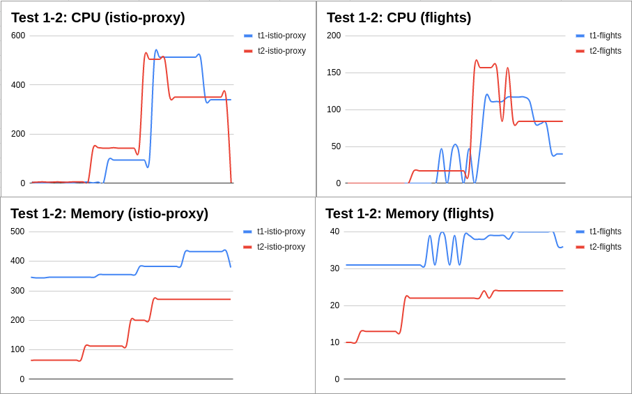
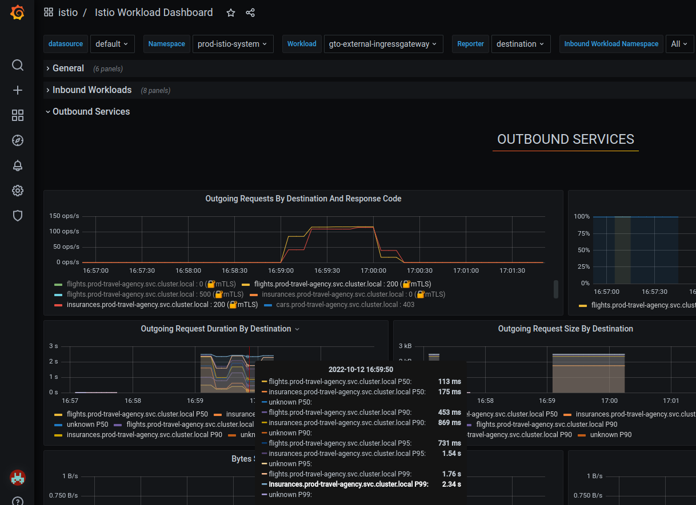
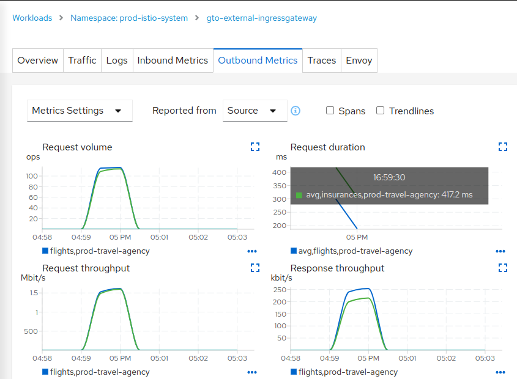
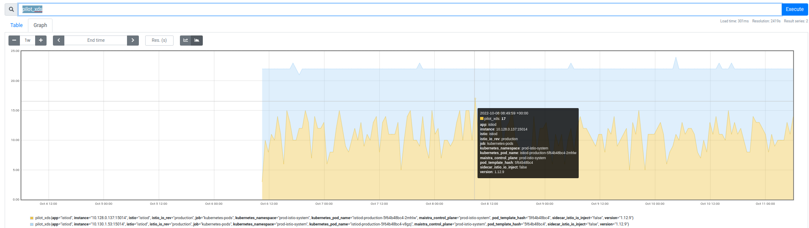
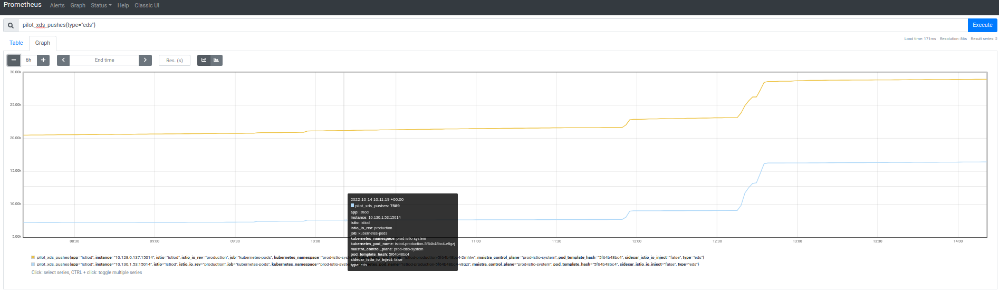
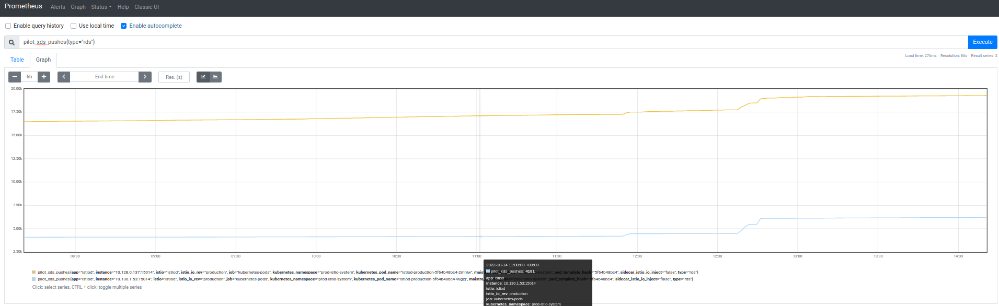
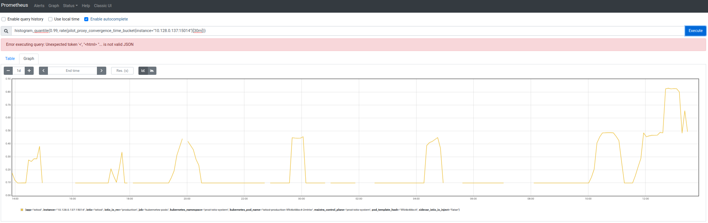

= Tuning the Mesh
:toc:

== `Service Mesh` Tuning Requirements

In the efforts to tune a _Service Mesh_ the usual two concerned parties which will provide non-functional requirements are the _Application Team_ and the _Platform Team_. These will have expressed the following type of tuning expectations:

* The Travel Agency _Application Team_ (includes `Product Owners`, `Tech Leads`, `Mesh Developers`) who need to tune the application side to handle the expected customer load have provided us with the following expectations.
____
Expected load is *_250k_* requests per day with a peak of *_250 requests per second(rps)_*.
____
* The Travel Agency _Platform Team_ (includes `Cluster Operators`, `Mesh Operators`, `Platform (Application Ops) Team`) who need to tune the _control plane_ side of the `Service Mesh` to handle observability, ingress/egress application runtime and configuration needs have the following concerns as internal cloud providers:

____
What are the best practices / sizing guides / benchmarks so that we can anticipate the best evolution of the `OSSM` instance and give best experience to the project teams?

- How to define the maximum capacity of an `OSSM` instance?
- How to define the maximum number of applications that can join the mesh in the future?
- Which criteria/metrics should be used for capacity rules?
- What are current limits of an `OSSM` instance on the _control plane_ and the _data plane_ side?
____

== `Service Mesh` Tuning Focus

It is important as _first practice_, in tuning a _Service Mesh_, to have an architecture decision on the link:https://docs.openshift.com/container-platform/4.11/service_mesh/v2x/ossm-deployment-models.html[Deployment Model] to be used with that mesh and to have established link:https://gitlab.consulting.redhat.com/servicemesh-in-action/ossm-heading-to-production-and-day-2/-/blob/main/scenario-3-prod-basic-setup/README.adoc#user-content-final-service-mesh-production-setup[_Purpose and Principals_] around the use and setup of this _Service Mesh_ as these will determine the type of tuning required.

Furthermore, be aware that in a cloud based environment there are many components that should be tuned (firewalls, loadbalancers, container platform etc.) we shall focus the following guidance only on the Red Hat `OSSM` 2 major areas:

* The _data plane_ which is consisted by all the `istio-proxy` sidecars (_Envoy_), responsible for handling a workload's incoming traffic, injected into the Pods of every workload as well as the `ingress`/`egress` gateway components.
* The _control plane_, responsible for keeping the proxies up-to-date with the latest configuration, certificates etc,  and the observability stack.

In the following sections we focus guidance around:

* How to test the performance of the mesh (the _data plane_'s specific non-functional needs as well as the _control plane_ components),
* How to measure sizing needs (eg. with a set of apps and established requests how much storage for tracing/metrics, how many `istiod` components to use, what CPU/RAM is required by the sidecar  etc.)
* What can be tuned (eg. the configuration visibility, % of traces collected, replicas, threads etc.)

== Sizing the _Data Plane_

The _Application Team_ will need to tune the _data plane_ components (`Ingress`/`Egress` workloads and `istio-proxy` sidecars) for _memory_, _cpu_ and _threads_ in such a way that they meet the solution's *_latency_* and *_throughput_* targets.

Like in any other tuning exercise in order to size correctly a mesh _data plane_ a set of scenarios based on real-world expected load is required. They will provide separate load test configurations based on which the components will be tuned until the output based on the requirements is reached. In the end, the _sizing_ of the solution is determined by the expected performance output.

=== Practical _Data Plane_ Tuning exercise

In this exercise we will showcase a process of tuning the `flights` and `mysqldb` _data plane_ components to cater for better performance when receiving upto *_250/rps_* from the external partner via `gto-external-ingressgateway` gateway. The link:https://linux.die.net/man/1/siege[siege] _http_ multi-threaded load testing and benchmarking utility has been employed to perform the tests.

. In preparation for the tests relax the _TLS_ settings for `Gateway/travel-api-gateway` to _SIMPLE_ TLS by executing `./scripts/set-simple-tls-travel-api-gateway.sh`
. Prepare to observe statistics and metrics around the performance and resources utilization which constitute application performance _Service Level Indicators (SLIs)_.
* using script `./scripts/containers-mem-cpu.sh "POD NAME     <mysqldb|flights|istio-proxy>" (eg. get the filter by executing `kubectl top pods --containers|sort -rk1 |grep "mysqldb-v1-56f4f9d879-gjltv"` CPU/Memory resource needs can be captured for the main workload and `istio-proxy` containers. In 4 command separate prompts monitor:
+
----
./containers-mem-cpu.sh  "mysqldb-v1-56f4f9d879-gjltv     mysqldb"
./containers-mem-cpu.sh  "mysqldb-v1-56f4f9d879-gjltv     istio-proxy"
./containers-mem-cpu.sh  "flights-v1-5c4bfff4b7-brwr8     flights"
./containers-mem-cpu.sh  "mysqldb-v1-56f4f9d879-gjltv     istio-proxy"
----
* prepare to monitor in `PROMETHEUS` the increase between `istio_request_duration_milliseconds` over `istio_request_duration_milliseconds_count` (the metrics can be used for the calculation of the average request duration, application _SLI_, over arbitrary lookbehind window specified in square brackets of the following query). There are many dimensions for the metric (eg. `response_code=200/500`, `reporter=source/destination` etc.)  it is important to capture possible average duration increases (ie. added latency), throughput of requests and if there are any failures (eg. `response_code=500`) due to resource contention.
+
----
increase(istio_request_duration_milliseconds_sum{destination_canonical_service="flights"}[5m])   / increase(istio_request_duration_milliseconds_count{destination_canonical_service="flights"}[5m])
----
. Get a valid _JWT TOKEN_ for the requests and execute via the `siege` tool a load test (duration of tests _1 minute_).
+
----
TOKEN=$(curl -sLk --data "username=gtouser&password=gtouser&grant_type=password&client_id=istio&client_secret=bcd06d5bdd1dbaaf81853d10a66aeb989a38dd51" https://keycloak-rhsso.apps.ocp4.rhlab.de/auth/realms/servicemesh-lab/protocol/openid-connect/token | jq .access_token)
siege -b -c500 -t60s https://gto-external-prod-istio-system.apps.ocp4.rhlab.de/flights/Tallinn --header="Authorization: Bearer $TOKEN"
----

==== Test 1 - Default _data plane_ values

* `siege` results show `97.51%` success on the requests with `7049` success vs `174` failures and a `1.13s` avg response time
+
----
Lifting the server siege...
Transactions:               6822 hits
Availability:               97.51%
Elapsed time:               59.14 secs
Data transferred:           0.83 MB
Response time:	            1.13 secs
Transaction rate:           115.35 trans/sec
Throughput:                 0.01 MB/sec
Concurrency:	            130.67
Successful transactions:    7049
Failed transactions:	    174
Longest transaction:	    10.16
Shortest transaction:	    0.24
----

* In `PROMETHEUS` we noticed that there was a:
** `660 ms` average increase in the duration spent on requests yielding `response_code=500` responses, indicating not all requests were successful as the setup could not handle the requested load.
** `114 ms` increase in the duration spent to handle requests from the `travels` service (which is non-partner constant traffic) with _200_ responses (normally avg is `28ms`), due to the added load.
** `473 ms` increase in the duration spent to handle partner requests yielding on _200_ responses, again due to the added load.

==== Test 2 - Increase sidecar concurrency with extra worker threads

In the second test tune the `istio-proxy` to take advantage of `4` concurrent worker threads (from the link:https://istio.io/latest/docs/reference/config/istio.mesh.v1alpha1/#ProxyConfig[default `2`]) in serving requests.

* Apply to the `flights` and `mysqldb` deployments the annotation
+
----
      annotations:
        proxy.istio.io/config: |
          concurrency: 4
----
** once the POD has been restarted verify the available _worker threads_ are now 4 by executing
+
----
oc exec <POD-NAME> -c istio-proxy -- curl localhost:15000/stats |grep worker

server.worker_0.watchdog_mega_miss: 0
server.worker_0.watchdog_miss: 0
server.worker_1.watchdog_mega_miss: 0
server.worker_1.watchdog_miss: 0
server.worker_2.watchdog_mega_miss: 0
server.worker_2.watchdog_miss: 0
server.worker_3.watchdog_mega_miss: 0
server.worker_3.watchdog_miss: 0
----

* Taking the same observability actions and executing the previous `siege` loadtest we receive the following results:
+
----
Lifting the server siege...
Transactions:	            8092 hits
Availability:	            98.73%
Elapsed time:	            59.82 secs
Data transferred:           0.96 MB
Response time:	            0.80 secs
Transaction rate:           135.27 trans/sec
Throughput:                 0.02 MB/sec
Concurrency:	            108.69
Successful transactions:    8188
Failed transactions:	    104
Longest transaction:	    6.92
Shortest transaction:	    0.24
----

The results yield the following observations:

* with `8188` successful transactions
** an improvement of the _troughput_ application _SLI_ by `16%`,  which is a `42%` decrease in failed transactions (`98.73%` successes and `104` failed), and
** a `29%` decrease of the application _SLI_ of response time (down to `0.8s`),
** overall a `14%` increase in throughput and `40%` reduction on the longest transaction.
* In `PROMETHEUS` we observe that during this test there is:
** a `390 ms` average duration increase spent on requests yielding `response_code=500` responses. There are still failed requests but with a `41%` smaller increase than *_Test 1_*.
** a `69 ms` increase in the duration spent to handle requests from `travels` service (which is normal non-partner traffic) with _200_ responses. Again `40%` reduction than *_Test 1_* which indicates we can handle more load successfully.
** a `181 ms` increase in the duration spent to handle partner requests yielding a _200_ responses. With a reduction of `66%` from *_Test 1_* we have another indicator the change has increased the capability to handle more requests.

Overall we notice that by tuning the _worker threads_ on the _data plane_ for these two components we managed to increase _throughput_ whilst at the same time _CPU_ and _memory_ utilized by the `istio-proxy` remains largely unchanged (see below data captured with `containers-mem-cpu.sh`).

==== Test 3 - Increase database concurrency

One final tuning action performed is against the actual `mysql` database. Utilizing the `mysql-credentials` and the _root_ user check in the `mysqldb` POD for the available connections and notice that `max_connections` available is set to `151` which has already been reached (see `Max_used_connections`) and presents a bottleneck. In response, tune the workload connections and repeat the tests.

----
select version();show variables like "%max_connections%";show global status like "%Max_used%";show status like "%thread%";show global status like "%Aborted%";
+------------------------+-------+
| Variable_name          | Value |
+------------------------+-------+
| max_connections        | 151   |
| mysqlx_max_connections | 100   |
+------------------------+-------+
+---------------------------+---------------------+
| Variable_name             | Value               |
+---------------------------+---------------------+
| Max_used_connections      | 152                 |
| Max_used_connections_time | 2022-10-11 13:08:32 |
+---------------------------+---------------------+
----

Increase `mysqld` `max_connections` to 250

----
set global max_connections = 250;
----

Following the same observability activities and executing the `siege` loadtest the following results show:

* An additional `10%` increase of _troughput_ with `8955` successful transactions and a `100%` success rate.
* At `0.69s` an additional `14%` decrease in response time
* With `148.42 trans/sec` an additional `14%` increase and
* An additional `40%` reduction on the longest transaction
* However, the transactions are at `148.42 trans/sec` and therefore below the *_250/rps_* target.

----
Lifting the server siege...
Transactions:               8785 hits
Availability:               100.00 %
Elapsed time:               59.19 secs
Data transferred:           1.05 MB
Response time:              0.69 secs
Transaction rate:           148.42 trans/sec
Throughput:                 0.02 MB/sec
Concurrency:                102.48
Successful transactions:    8955
Failed transactions:        0
Longest transaction:        9.44
Shortest transaction:       0.23
----

In addition the `max_used_connections` requested at the database, during these tests, has reached `199` which is less than the available `250` and therefore there is additional capacity.
----
+---------------------------+---------------------+
| Variable_name             | Value               |
+---------------------------+---------------------+
| Max_used_connections      | 199                 |
| Max_used_connections_time | 2022-10-11 15:30:55 |
+---------------------------+---------------------+
----

==== Test 4 - 500 concurrent users

In a final test increasing the `max_connections=400` and the concurrent `siege` users to `500` (default is 255) we reach `210 trans/sec` without `5xx` responses but with a slight increase in latency.

With the target throughput almost reached we can look at the resources required by a single POD, which are:

* `800m` _CPU_ time for the `istio-proxy` and `200m` for the `flights` container
* `800Mi` _memory_ for `istio-proxy` and `45m` for the `flights` container

For further understanding of the needs and capabilities of the environemnt contrast these measurements against the expected performance of Istio link:https://docs.openshift.com/container-platform/4.11/service_mesh/v2x/ossm-performance-scalability.html#cpu-and-memory-consumption[CPU and memory consumption].

Following the same technique the remainder of the components in the flow can be tuned and instances scaled out to reach the desired throughput. In addition, the _Application_ and _Platform_ teams with these information can start calculating on capacity in the mesh and cluster.

=== What to monitor in the _data plane_

Following the example of _how to test the performance_ of the _data plane_ we proceed to determine what to monitor in order to make sizing decisions.

. _Istio_, on which `OSSM` is based on, defines a list of link:https://istio.io/latest/docs/reference/config/metrics/#metrics[metrics] which we can monitor for HTTP, HTTP/2 GRPC and TCP traffic. In particular:
* `istio_requests_total` a COUNTER measuring total number of requests
* `istio_request_duration_milliseconds` a DISTRIBUTION measuring latency of requests
** In addition to monitoring for successful responses (`response_code=200`) this metric can also be used to monitor failed requests which may be increasing due to performance issues (ie. `istio_request_duration_milliseconds_bucket{response_code="400"}`, `istio_request_duration_milliseconds_bucket{response_code="503"}`).
+
The `grafana` and `kiali` observability components allow (as does the output form `siege`) to determine both _throughput_ and _latency_.
+

+

+
Whilst with the use of `prometheus` alerts can be set against metrics such as the distribution of the request duration (`istio_request_duration_milliseconds`) in order to review and tune accordingly the _data plane_.

* Needs for tuning between services with `DestinationRules` and configured pool connections may be uncoverd when monitoring client latency averaged over the past minute by source and destination service names and namespace
+
----
histogram_quantile(0.95,
  sum(irate(istio_request_duration_milliseconds_bucket{reporter="source"}[1m]))
  by (
    destination_canonical_service,
    destination_workload_namespace,
    source_canonical_service,
    source_workload_namespace,
    le
  )
)
----

. Tuning of the individual container resources is equally important. The script provided during the tuning exercise offers a means of retrieving the CPU/Memory of the `istio-proxy` and main `workload` containers whilst prometheus also exposes the _envoy_ memory metrics (on prometheus `envoy_server_memory_allocated{app="gto-external-ingressgateway"}`, `envoy_server_memory_heap_size{app="gto-external-ingressgateway"}`)
+
----
oc exec gto-external-ingressgateway-5d9b4c5b6d-8ddqt -n prod-istio-system -- curl -s localhost:15000/memory; sleep 5; done
{
  "allocated": "54066928",
  "heap_size": "128974848",
  "pageheap_unmapped": "0",
  "pageheap_free": "12517376",
  "total_thread_cache": "29052632",
  "total_physical_bytes": "131989504"
}
----

=== _Data Plane_ Tuning Advice

Normal _HA_ Microservice Guidelines affect the performance within a `Service Mesh` therefore need to be taken into account in addition to tuning the _data plane_ and include:

* POD Priority and Preemption (most important PODs have scheduling priority)
* Configure Liveness, Readiness, Startup probes
* Realistic compute resources set for containers (use existing known limits for each container) and autoscalling (_HPA_) settings.
* `Deployment` Strategy selection (RollingUpdate with rollout strategy with `maxUnavailable=1` and `maxSerge=0`)
* Application/Database managed (beyond `sidecar`) connection pools tuning and configuration must be applied.

Proxy (_Envoy_) tuning would include:

* increasing application concurrency when too thin. This can be achieved by increasing worker threads on the _envoy_ (`default=2`) which can improve the _throughput_.
* upgrading traffic to HTTP2 as multiplexing several requests over the same connection avoids new connection creation overheads.
* tuning the pool connections via _Istio_ configurations can also improve the performance of the network. Specifically monitor for the
** _Number of client connections_
** _Target request rate_
* An additional tuning which can affect both the _data plane_ and _control plane_ is the size of the configuration used by the proxy. This is increased linearly as more services are added to the mesh. As this needs to be transferred to, accepted and maintained it is important that only the necessary configs reach a particular proxy.

_Observability_ optimizations (we shall look at this during _control plane_ tuning) with reduction of `trace` sampling rates can also significantly improved throughput.

==== Tuning for high-throughput demands

For very high-throughput demands from workloads in the mesh consider:

* placing the `Ingress`/`Egress` Gateway PODS in dedicated Kubernetes nodes and possibly split for SNI proxies.
* tune the appropriate between worker threads (scale up) based also on the number of cores available on the node versus increase of the number of such pods (scale out) in order to match the necessary requirements
* limiting the number of connections (`connection_limit`) on overloaded listeners (downstream connections) to improve loadbalancing between available pods
* loadbalancing between multiple _threads_ on the sidecar may not be so efficiently applied. Add the following annotation:
+
----
      annotations:
        proxy.istio.io/config: |
          proxyStatsMatcher:
            inclusionRegexps:
            - ".*_cx_.*"
----
** and check the distribution on connections to the different downstream/upstream threads (see link:https://blog.mygraphql.com/en/posts/cloud/istio/istio-tunning/istio-thread-balance/[starvating threads]])
+
----
oc exec <POD NAME> --curl localhost:15000/stats |grep worker
...
listener.0.0.0.0_8000.worker_0.downstream_cx_active: 1
listener.0.0.0.0_8000.worker_0.downstream_cx_total: 4
listener.0.0.0.0_8000.worker_1.downstream_cx_active: 0
listener.0.0.0.0_8000.worker_1.downstream_cx_total: 0
listener.0.0.0.0_8000.worker_2.downstream_cx_active: 0
listener.0.0.0.0_8000.worker_2.downstream_cx_total: 1
listener.0.0.0.0_8000.worker_3.downstream_cx_active: 0
listener.0.0.0.0_8000.worker_3.downstream_cx_total: 1
----
** `LEAST_CONN` rather than `ROUND_ROBIN` loadbalancing policy in the `DestinationRules` can also help with more efficient placement of requests.

== Sizing the _Control Plane_

The main outcome for a _control plane_ tuning exercise should be the answer to the following questions:

* Can the _control plane_ support the _data plane_, ie. can it keep it up-to-date with the latest configurations in an acceptable rate?
* How much more _data plane_ capacity can it handle?
* What are the required resources for the observability stack?

=== `istiod` metrics to monitor

=====
NOTE: link:https://istio.io/latest/docs/reference/commands/pilot-discovery/#metrics[Review exported metrics]
=====

The answer to these questions can be extracted by focusing on a number of _metrics_:

* `pilot_xds`: The number of endpoints connected to this _pilot_ (`istiod`) using *_xDS_* or simply clients who need to be kept up-to-date by the _control plane_.
+

+
If `istiod` is using _memory_ or _CPU_ more heavily than usual check if there has been an increase of _xDS_ clients and adjust either the `resource` limits for _pilot_ or the replicas of the _pilot_ (`istiod`) deployment instances.

* `pilot_xds_pushes`: The count of _xDS_ messages sent, as well as errors building or sending _xDS_ messages. What we are looking from this metric is _throughput_ and _errors_ in distributing the configurations. The rate of xDS pushes increases with the number of clients connected to _pilot_ (`istiod`) as well as the number of _pilot_ configuration changes. The `pilot_xds_pushes` metric counts the messages that pilot has pushed to xDS APIs, including any errors in building or sending xDS messages.
You can group this metric by the type tag to count xDS pushes by API (e.g., eds or rds)—if there are errors, pilot will record this metric with a different type.
+
** If high _pilot_ demand is a problem adjust either the `resource` limits for _pilot_ or replicas of the _pilot_(`istiod`) deployment instances.
** It is also possible to edit the `PILOT_PUSH_THROTTLE` environment variable within for `istiod` reducing the maximum number of concurrent pushes from the default of `100`.

* `pilot_proxy_convergence_time`: The time it takes for _pilot_ to push new configurations to _Envoy_ proxies (in milliseconds). Once more this is an indication of the increase/decrease of _pilot_ (`istiod`) performance to push the new configurations. The speed of this operation depends on the size of the configuration being pushed to the _Envoy_ proxies (`istio-proxy`), but necessary for keeping each proxy up to date with the routes, endpoints, and listeners in the mesh. Monitor that it is kept at a reasonable level (eg.`increase(pilot_proxy_convergence_time_sum[30m])/increase(pilot_proxy_convergence_time_count[30m])`).
** Increase of the clients handled by a single `istiod` can hurt this metric, therefore increasing replicas of `istiod` by applying appropriate _HPA_ policies would help here.
** An increase on the PODs that are part of the _data plane_ would also result in larger configuration (dependent on how many clusters, routes, listeners, endpoints) transferred to a sidecar. Separating the mesh ie. ensuring configurations are only visible to the appropriate namespaces, separating unrelated services to different meshes or excluding services from the mesh would be some solutions.

=== `istiod` sizing

In the _Travel Agency_ production service mesh the configuration includes _10 services_, _67 xDS cluster_ configurations and _83 Endpoint_ configurations. Performing additions of new namespaces and services increases the demands from the `istiod` as follows:

* Adding *_1_* namespace with *_8_* new services results in the addition of _7 new xDS clusters_ and _14 endpoints_ and the `pilot_xds` shows _36 connected endpoints_ to be kept up to date.
+
----
./add-new-travel-services-namespaces-in-mesh.sh cp-size-1 prod-istio-system
----
+
[cols="2,4,4"]
.istioD resource requirements
|===
|istiod |Memory Change |CPU Change

| istiod-1  | 128Mi -> 134Mi |2.36m -> 3.0m

| istiod-2  | 103Mi -> 130Mi |3.2m - 4.7m

|===
* As the connected clients are not equally distributed between the instances of `istiod` the total increase is attributed to the additional xDS clients and therefore we expect an increase of Memory `4.71Mi/client` and CPU `0.3m/client`.

* Adding *_3_* additional namespaces with _24 new services_ results in the addition of _21 new xDS_ clusters and _42 endpoints_ and the `pilot_xds` shows _94 connected endpoints_ to be kept up to date. The increase of the _data plane_ size has affected the `istioD` resource requirements as follows:
+
[cols="2,4,4"]
.istioD new resource requirements
|===
|istiod |Memory Change |CPU Change

| istiod-1  | 134Mi -> 167Mi |3.0m -> 4.5m

| istiod-2  | 130Mi -> 142Mi |4.7m - 7.1m

|===

* The total increase is attributed to the additional xDS clients and therefore we expect an increase of Memory `2.14Mi/client`(`+1%`) and CPU `0.18m/client`(`+3%`).

With the introduction of new `xDS` clients the `xDS` update activities have significantly increased on the `istiod`

* _EDS_ updates
+

* _RDS_ updates
+

* In addition, the `99th` percentile of configuration transfers has seen an increase in the time required and it will be monitored along the `istiod` resource utilization for possible _HPA_ or manual scaling.
+

* For additional guidance on resource allocations for the _control plane_ see the link:https://docs.openshift.com/container-platform/4.11/service_mesh/v2x/ossm-performance-scalability.html[OSSM Performance and scalability].

==== _istiod_ Tuning Advice

In the case that the mesh _data plane_ increases significantly (eg. many 100s of PODs) it is advisable to:

a. review the link:https://docs.openshift.com/container-platform/4.11/service_mesh/v2x/ossm-deployment-models.html[Deployment Model] of the service mesh. For instance choosing multi-tenancy over single mesh in a cluster in order to have focused mesh clusters to the solutions they include will have to be evaluated.
b. separation of the _visibility_ of the resource configurations in the same mesh by applying the `Sidecar` resource to segregate unrelated namespaces.
c. appropriate _HPA_ settings for the `istiod` components set for a pre-defined increase of a set of new _xDS_ clients.

=== Observability Stack sizing

Capacity planning for the observability stack involves the sizing of:

* Runtime components (Kiali, Jaeger, ElasticSearch - for Jaeger Storage-, Prometheus, Grafana)
* Persistence for long-term storage of metrics, traces, graphs etc.

The capacity requirements are directly dependent to the size of the _data plane_ (sidecars), the number of incoming requests and configuration of metrics and traces capture as well as their retention period. In the _Production Setup_ scenario we established a link:https://gitlab.consulting.redhat.com/servicemesh-in-action/ossm-heading-to-production-and-day-2/-/blob/main/scenario-3-prod-basic-setup/README.adoc#user-content-final-service-mesh-production-setup[Final Service Mesh Production Setup] based on which the `production` SMCP has been configured. We shall now look if this configuration is appropriate for the established _non-functional_ requirements.

==== Prometheus sizing

During the activity to link:https://gitlab.consulting.redhat.com/servicemesh-in-action/ossm-heading-to-production-and-day-2/-/blob/main/scenario-3-prod-basic-setup/README.adoc#user-content-option-1-setup-persistencevolume-for-smcp-created-prometheus-resource[Configure Prometheus for Production] a `PersistenceVolume` of *_10Gi_* in size was allocated to store metrics for the production environment.

In order to establish if this allocation is sufficient in handling the expected load consider the following expectations:

* Traffic of *_250k_* requests per day
* Retention of metrics for *_7 days_*
* Full _Istio_ metrics collection, ie. no link:https://kiali.io/docs/configuration/p8s-jaeger-grafana/prometheus/#prometheus-tuning[Prometheus Metric Tuning] has been applied.

To establish the sizing needs use the following `prometheus` queries:

* `prometheus_tsdb_head_samples_appended_total` shows how many samples are stored, whilst (`(rate(prometheus_tsdb_head_samples_appended_total[1d]))`) gives the average.
* `rate(prometheus_tsdb_compaction_chunk_size_bytes_sum[1d])) / rate(prometheus_tsdb_compaction_chunk_samples_sum[1d])` shows what is the average byte size of each sample ingested.
* Therefore, for _7 days_ (or `604800` seconds) which is the metrics retention period, current total requests `90908542` (avg `1052` samples per second) and with an average byte size of each ingested sample at  (`1.28`), the result is *_1.21 GBs_* of storage is the required storage space.
+
----
(604800* (rate(prometheus_tsdb_head_samples_appended_total[1d]) *
(rate(prometheus_tsdb_compaction_chunk_size_bytes_sum[1d]) / rate(prometheus_tsdb_compaction_chunk_samples_sum[1d]))))/1000000000
----
* Currently, the total requests for 1 day (`istio_requests_total{reporter=source}`) is almost at `252286` therefore the capacity allocated will meet the expected demands.

If tuning of the `prometheus` metrics collection is deemed necessary, this can be applied either on the timeseries collected by, eg. link:https://kiali.io/docs/configuration/p8s-jaeger-grafana/prometheus/#prometheus-tuning[Prometheus Metric Tuning], or additionally in the `SMCP` settings for the https://github.com/maistra/istio-operator/blob/1ed098a045097fe6556b4d234d050c28d813a05c/pkg/apis/maistra/v2/smcp_new.yaml#L385[`addons.prometheus.install.retention`] and https://github.com/maistra/istio-operator/blob/1ed098a045097fe6556b4d234d050c28d813a05c/pkg/apis/maistra/v2/smcp_new.yaml#L386[`addons.prometheus.install.scrapeInterval`].

==== Jaeger and ElasticSearch sizing

During the link:https://gitlab.consulting.redhat.com/servicemesh-in-action/ossm-heading-to-production-and-day-2/-/blob/main/scenario-3-prod-basic-setup/README.adoc#user-content-configure-servicemeshcontrolplane-tracing-for-production[`Jaeger Configuration for Production`] the `Jaeger` resource was externalized from the `SMCP` and configured with an `ElasticSearch` single node cluster storage of *_1Gi_* in size.

The three key components to remember before choosing the appropriate Elastic Search cluster settings are as follows:

* Calculating the storage requirements.
+
To calculate the index size follow link:https://access.redhat.com/solutions/5955091[How to check Elasticsearch index usage with CLI in OpenShift Container Platform]. In the current `jaeger-small-production` `Jaeger` resource for the `production` _SMCP_ the size of a single `shard` (replica) of the index, of traces collected over _7 days_,  is *_519Mbs_*. As the strategy is to _Rollover Index_ the size of *_1Gi_* should be sufficient.
+
It is crucial for the sizing calculations to take into account the applied link:different[_sampling_ rate] on the _data plane_. In the `production` _SMCP_ the sampling rate is applied across all sidecars, set to _5%_, however in the case that a service contains a different sampling rate then it is important to be aware that the sampling rate of traces is determined by the *_first_* microservice in the flow, where the _span_ is generated, and that point onwards it is respected by all other services in the flow.
+
----
oc exec elasticsearch-cdm-prodistiosystemjaegersmallproduction-1-7pwcmt -c elasticsearch -- curl -s --cacert /etc/elasticsearch/secret/admin-ca --cert /etc/elasticsearch/secret/admin-cert --key /etc/elasticsearch/secret/admin-key -X GET "https://localhost:9200/_cat/shards?v

index                     shard prirep state      docs  store ip          node
jaeger-service-2022-10-17 0     p      STARTED      34 15.2kb 10.130.0.18 elasticsearch-cdm-prodistiosystemjaegersmallproduction-1
jaeger-span-2022-10-11    0     p      STARTED  911317 32.3mb 10.130.0.18 elasticsearch-cdm-prodistiosystemjaegersmallproduction-1
jaeger-service-2022-10-14 0     p      STARTED      38 16.4kb 10.130.0.18 elasticsearch-cdm-prodistiosystemjaegersmallproduction-1
jaeger-span-2022-10-15    0     p      STARTED  230716  8.2mb 10.130.0.18 elasticsearch-cdm-prodistiosystemjaegersmallproduction-1
jaeger-span-2022-10-18    0     p      STARTED  408303 14.1mb 10.130.0.18 elasticsearch-cdm-prodistiosystemjaegersmallproduction-1
jaeger-service-2022-10-16 0     p      STARTED      21  9.9kb 10.130.0.18 elasticsearch-cdm-prodistiosystemjaegersmallproduction-1
jaeger-service-2022-10-13 0     p      STARTED      27 26.2kb 10.130.0.18 elasticsearch-cdm-prodistiosystemjaegersmallproduction-1
jaeger-span-2022-10-17    0     p      STARTED  552569 19.3mb 10.130.0.18 elasticsearch-cdm-prodistiosystemjaegersmallproduction-1
jaeger-service-2022-10-12 0     p      STARTED      29 39.5kb 10.130.0.18 elasticsearch-cdm-prodistiosystemjaegersmallproduction-1
jaeger-service-2022-10-11 0     p      STARTED      36 23.1kb 10.130.0.18 elasticsearch-cdm-prodistiosystemjaegersmallproduction-1
jaeger-span-2022-10-12    0     p      STARTED  933030 32.9mb 10.130.0.18 elasticsearch-cdm-prodistiosystemjaegersmallproduction-1
jaeger-span-2022-10-14    0     p      STARTED  584263 20.5mb 10.130.0.18 elasticsearch-cdm-prodistiosystemjaegersmallproduction-1
.security                 0     p      STARTED       6   33kb 10.130.0.18 elasticsearch-cdm-prodistiosystemjaegersmallproduction-1
jaeger-service-2022-10-15 0     p      STARTED      21 21.4kb 10.130.0.18 elasticsearch-cdm-prodistiosystemjaegersmallproduction-1
jaeger-span-2022-10-16    0     p      STARTED  187394  6.7mb 10.130.0.18 elasticsearch-cdm-prodistiosystemjaegersmallproduction-1
jaeger-service-2022-10-18 0     p      STARTED      33 28.6kb 10.130.0.18 elasticsearch-cdm-prodistiosystemjaegersmallproduction-1
jaeger-span-2022-10-13    0     p      STARTED 1083306 38.5mb 10.130.0.18 elasticsearch-cdm-prodistiosystemjaegersmallproduction-1
----

* Choosing the number of shards (ie. number of replications of an index)
+
The second component to consider is choosing the right indexing strategy for the indices. In ES, by default, every index is divided into n numbers of primary and replicas. (For example, if there are 2 primary and 1 replica shard then the total count of shards is 4). The primary shard count for an existing index cannot be changed once created.
+
A rule of thumb is to ensure that the shard size is between 10–50 GiB and therefore a formula for calculating the approximate number of shards is:
+
----
Number of Primary Shards = (Source Data + Room to Grow) * (1 + Indexing Overhead) / Desired Shard Size
eg.
with 30 GiB of data and whilst we don’t expect it to grow over time (ie. no new services added or sampling rates changed) the number of shards should be (30 * 1.1 / 20) = 2.
----

* Choosing the instance types and testing.
+
A stable `Elastic Search` cluster will require for the nodes to a establishing a quorum. The size of the quorum (3 at minimum) is dependent of the size of the `Elastic Search` cluster (for more information see https://www.elastic.co/guide/en/elasticsearch/reference/current/high-availability-cluster-small-clusters.html#high-availability-cluster-design-three-plus-nodes[Resillience in small clusters])

==== Grafana Persistence sizing

Although there are no specific sizing information on `grafana` it is useful to note that the persistence and runtime requirements for Grafana are affected by the number of timeseries monitored by `prometheus` (`sum(prometheus_tsdb_head_series)`) and frequence the metrics are captured as well as by the dashboards monitored.

== Tuning across service mesh layers

The above information provide guidance to _Application_ and _Platform_ teams on uncovering capacity needs. However, in order to fine-tune a service mesh across the _control plane_ and _data plane_ of the service mesh aspects such as TLS settings in and out of a cluster, service to service communication requirements, bootstrapping configuration, latency tuning, infrastructure configuration, etc., need to be well understood before arriving at a stable set of benchmarks.

IMPORTANT: Next in link:../scenario-9-mesh-upgrade/README.adoc[Day-2 - Upgrade] Help the Travel Agency personnel get an undertanding of the `OSSM` versioned components and the work involved for an upgrade.

== Appendix Resources

=== istio-proxy metrics

* link:https://istio.io/latest/docs/concepts/observability/#proxy-level-metrics[Proxy Metrics]
* link:https://istio.io/latest/docs/reference/config/metrics/[Istio Metrics]
* link:https://istio.io/latest/docs/ops/configuration/telemetry/envoy-stats/[Envoy Statistics]
* link:https://www.envoyproxy.io/docs/envoy/latest/operations/stats_overview[Envoy Stats Overview]

=== istiod metrics

* link:https://istio.io/latest/docs/reference/commands/pilot-discovery/#metrics[Pilot Metrics]

=== Observability stack

* link:https://kiali.io/docs/configuration/p8s-jaeger-grafana/prometheus/#prometheus-tuning[Prometheus Tuning]
* link:https://istio.io/latest/docs/ops/best-practices/observability/#using-prometheus-for-production-scale-monitoring[Using Prometheus for Production Scale Monitoring (Istio)]

=== Mesh Performance Testing Resources

* link:https://github.com/acidonper/maistra-test-tool/tree/feature/performance/performance[maistra-test-tool performance]
* link:link:https://linux.die.net/man/1/siege[siege]
* link:https://events.istio.io/istiocon-2022/sessions/scaling-to-1m-rps-with-multi-cluster-istio/[caling to 1m rps with multi-cluster-istio]
* link:https://locust.io/[Locust load-testing]
** link:https://aliesbelik.github.io/awesome-locust/[Awesome Locust]
** https://github.com/locustio/locust[Locust on Github]
*** https://www.google.com/url?sa=t&rct=j&q=&esrc=s&source=web&cd=&cad=rja&uact=8&ved=2ahUKEwj_tK3Kncv6AhUdgP0HHcdXAfsQwqsBegQINBAB&url=https%3A%2F%2Fwww.youtube.com%2Fwatch%3Fv%3DesIEW0aEKqk&usg=AOvVaw0zMTyti1XjewBJXfj3smsL[video 1 - Load Testing FastAPI with Locust Python]
*** video https://www.google.com/url?sa=t&rct=j&q=&esrc=s&source=web&cd=&cad=rja&uact=8&ved=2ahUKEwj_tK3Kncv6AhUdgP0HHcdXAfsQwqsBegQIMhAB&url=https%3A%2F%2Fwww.youtube.com%2Fwatch%3Fv%3DLecXT67dptQ&usg=AOvVaw18xpk7ekLnePFuAfSstTBX[video 2 - Locust - Python based Performance Testing Too]

=== Sizing and Tuning Practices

* link:https://istio.io/latest/docs/ops/deployment/performance-and-scalability/[Istio Performance and Scalability]
* link:https://istio.io/v1.10/blog/2019/performance-best-practices/[2019 Istio Performance Best Practices]
* link:https://docs.openshift.com/container-platform/4.11/scalability_and_performance/optimizing-networking.html[Optimizing networking]
* link:https://docs.openshift.com/container-platform/4.11/scalability_and_performance/recommended-install-practices.html[OCP Scalability & Performance Recommended host practices]]

