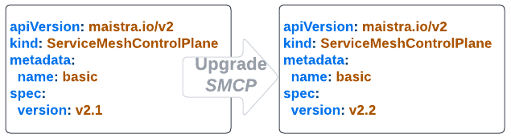
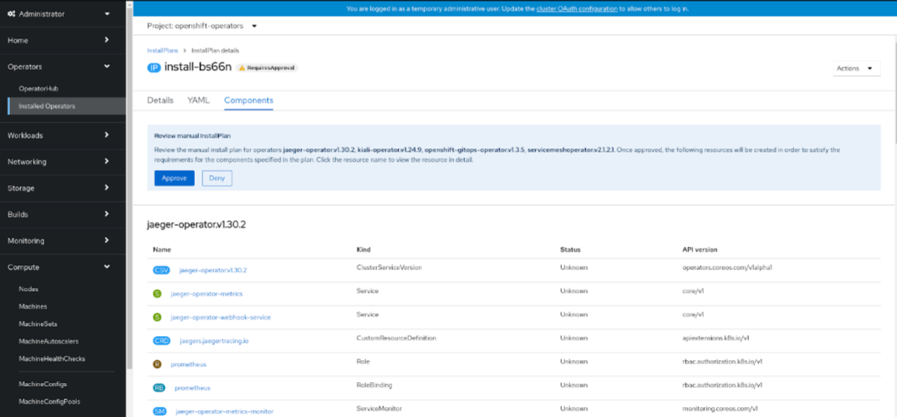
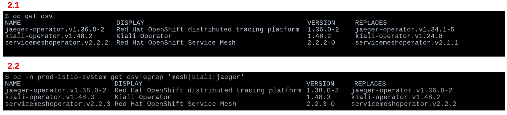

= Upgrade Mesh to a New Version
:toc:

== Service Mesh Versions

In order to define an upgrade action plan of the `OSSM` it is important to understand what `versions` of the components you are currently using. In the documentation link:https://docs.openshift.com/container-platform/4.11/service_mesh/v2x/upgrading-ossm.html#ossm-versions_ossm-upgrade[Understanding Service Mesh versions] and link:https://docs.openshift.com/container-platform/4.11/service_mesh/v2x/upgrading-ossm.html#how-versioning-affects-service-mesh-upgrades[How versioning affects Service Mesh upgrades] `OSSM` versioning and the impact is described. What we make an attempt to make clear here is:

* what are all the different component versions,
* when component versions are upgraded,
* whether the change is mandatory or if it can be planned.

The _Red Hat Openshift Service Mesh_ is composed of the following parts that are affected by versioning:

a. The `OSSM` operator
b. The `ServiceMeshControlPlane`
c. The observability stack components operators
d. The _data plane_ sidecar image

=== The `OSSM` operator version

The `OSSM` version determines

. the `OSSM` operator's `POD` image used to operate the _Service Mesh_,
. the https://docs.openshift.com/container-platform/4.11/service_mesh/v2x/servicemesh-release-notes.html#new-features-red-hat-openshift-service-mesh-version-2-2-3[Component versions included in Red Hat OpenShift Service Mesh version 2.2.3],
. the versions of `ServiceMeshControlPlane` which are supported
. the _CRDs_ supported in the new version (read the following for more details on the operator and the applied link:https://github.com/maistra/istio-operator/tree/maistra-2.3/resources/helm/v2.3/istio-init/files[_Operator applied Custom Resource Definitions_]).

Identify the current operator version as follows:
----
oc -n prod-istio-system get csv|grep servicemesh
NAME                                     DISPLAY                                          VERSION    REPLACES
servicemeshoperator.v2.2.3               Red Hat OpenShift Service Mesh                   2.2.3-0    servicemeshoperator.v2.2.2
----

=== The `ServiceMeshControlPlane` version

The link:https://docs.openshift.com/container-platform/4.11/service_mesh/v2x/ossm-create-smcp.html[`ServiceMeshControlPlane`] determines the features the _control plane_ will contain and how they will be configured. The `SMCP` version determines what version of _Red Hat OpenShift Service Mesh_ will be used and what the operator in turn will deploy.

Following an upgrade to the latest `OSSM` operator version you may or may not need to update to the latest supported `SMCP`. The operator will support previous _2.x_ `SMCP` deployments, in addition to the latest version _2.2_, and it will not make automatic updates to those deployments. Differences between the `SMCP` versions are listed at link:https://docs.openshift.com/container-platform/4.11/service_mesh/v2x/upgrading-ossm.html#ossm-upgrade-21-22-changes_ossm-upgrade[Upgrading the control plane] (or in detail the new SMCP options can be found in link:https://github.com/maistra/istio-operator/blob/1ed098a045097fe6556b4d234d050c28d813a05c/pkg/apis/maistra/v2/smcp_new.yaml#L337[github]). When the update of the `SMCP` version, as shown above, takes place it will affect:

. the versions of all the _control plane_ components (ingress and egress `gateway` and `istiod`),
. and the version of `sidecar` image injected into a _data plane_ POD (Note: for existing PODs this will only be changed after a POD restart).

=== The Observability operators version

The _Red Hat OpenShift Service Mesh_ relies on a set of components (`Jaeger`, `Elastic Search`, `Prometheus`, `Kiali`) to complete the observability part of the _Service Mesh_. These components' required versions are dependent on the version of the installed `OSSM` operator and `SMCP` used (see https://docs.openshift.com/container-platform/4.11/service_mesh/v2x/servicemesh-release-notes.html#new-features-red-hat-openshift-service-mesh-version-2-2-3[Component versions included in Red Hat OpenShift Service Mesh version 2.2.3]) as it is tested against them. The resources that each of those -additional- operators manages must be compatible with its version and this is important to keep in mind when creating/modifying, outside the `SMCP`, the configurations for these observability components (eg. production focused for `Jaeger` and `Elastic Search` or `Prometheus` setup etc.) as they will need to be kept up-to-date as part of the upgrade in-line with the new operator's capabilities.

----
NAME                        DISPLAY                                         VERSION     REPLACES
jaeger-operator.v1.36.0-2   Red Hat OpenShift distributed tracing platform  1.36.0-2    jaeger-operator.v1.34.1-5
kiali-operator.v1.48.2      Kiali Operator                                  1.48.2      kiali-operator.v1.24.8
servicemeshoperator.v2.2.2  Red Hat OpenShift Service Mesh                  2.2.2-0     servicemeshoperator.v2.1.1
----

== Upgrading Activities

Therefore, a _Service Mesh_ upgrade incorporates some _mandatory_ and some _optional_ aspects:

[cols="6,4"]
.OSSM Components Upgrade Necessity
|===
|Component |Upgrade Need

| OSSM Operator  | Mandatory

| Observability Operators | Mandatory

| `SMCP` version | Optional

| Sidecar Upgrade (via Restart) | Optional

|===

=== Upgrading `OSSM` Operator

When a new catalog source is installed in Openshift and there are new operator versions, a new installation plan is created automatically. In the case you chose link:https://docs.openshift.com/container-platform/4.11/service_mesh/v2x/upgrading-ossm.html#ossm-upgrading-operator_ossm-upgrade[`Manual`] option for `Update approval` during the initial installation then a manual acceptance of the installation plan is required in order to update the operators from/to the versions (see the following).

==== How To Upgrade in a Disconnected Environment?

In a scenario where an Openshift environment is disconnected from the public internet the result is it will not have access to the Red Hat image registry. Therefore,  the Openshift administrators will be required to mirror the Openshift images related to the target release in an internal container images registry before upgrading the cluster. The mirroring procedure and upgrade although it is important it is a cluster administration task beyond our purposes and we will defer to official Red Hat documentation. What is important though is for an administrator to be able to identify the new `OSSM` operator's images as there may be a link:https://docs.openshift.com/container-platform/4.11/service_mesh/v2x/upgrading-ossm.html#ossm-versioning_ossm-upgrade[patch/minor/major `OSSM` update] without necessarily an Openshift cluster upgrade.

In order to understand the Operator Lifecycle Management and what is required to do in a restricted network the following documentation will help:

* https://docs.openshift.com/container-platform/4.11/operators/understanding/olm/olm-understanding-olm.html[What is Operator Lifecycle Manager]
* https://docs.openshift.com/container-platform/4.11/operators/understanding/olm-rh-catalogs.html#olm-rh-catalogs[Red Hat-provided Operator catalogs]
* https://docs.openshift.com/container-platform/4.11/operators/admin/olm-restricted-networks.html[Using Operator Lifecycle Manager on restricted networks]
* https://access.redhat.com/articles/4740011?extIdCarryOver=true&sc_cid=701f2000001OH74AAG[Red Hat Operators Supported in Disconnected Mode]

For the `OSSM` operator the images required are listed in the `ClusterServiceVersion` which can be found in the OSSM's link:https://github.com/maistra/istio-operator/blob/maistra-2.3/manifests-servicemesh/2.2.2/servicemeshoperator.v2.2.2.clusterserviceversion.yaml[github repository].

=== Upgrade Result of `OSSM` Operator

Once the installation plan has been accepted, an upgrade procedure is triggered automatically and the operators link:https://docs.openshift.com/container-platform/4.11/service_mesh/v2x/upgrading-ossm.html#ossm-upgrading-operator_ossm-upgrade[start to upgrade].

The immediate outcome of this installation of the _2.2.3_ `OSSM` operator would be for the previously mentioned operators to be updated.

In the meantime, all the _control plane_ components (`Istiod`, `Ingress Gateways` and `Egress Gateways`) have been restarted in order to install the new `OSSM` version in the current _control plane_ version in use. However, the new version is not going to be used just yet until the `ServiceMeshControlPlane` version has also been upgraded and aligned with the `OSSM` version (this aspect becomes clear at link:https://gitlab.consulting.redhat.com/servicemesh-in-action/ossm-heading-to-production-and-day-2/-/tree/main/scenario-9-mesh-upgrade#user-content-control-plane-upgrade[_Control Plane_ Upgrade]).

It is also important to bear in mind that at this time the application services (_data plane_) would also have not been affected.

This as easily identifiable as the following picture shows, the new version of the `OSSM` (_2.2.3_ is based on link:https://docs.openshift.com/container-platform/4.11/service_mesh/v2x/servicemesh-release-notes.html#component-versions-included-in-red-hat-openshift-service-mesh-version-2-2-3[Istio _1.12.9_]) is installed but the previous Envoy image version is still in use.
----
$ oc exec istio-egressgateway-es-bb7f94d9c-vnfjz pilot-agent request GET server_info | grep version
"version": "c1a87dfff478ef4634eace723a64754c6b5f0109/1.14.5-dev/OSSM 2.0.9-3.el8/RELEASE/OpenSSL",

$ oc exec  istio-egressgateway-es-bb7f94d9c-vnfjz pilot-agent -- curl -s GET localhost:15000/config_dump | grep ISTIO_VERSION
"ISTIO_VERSION": "1.12.9",
----

With the upgrade to the latest version completed the changes, as the link:https://docs.openshift.com/container-platform/4.11/service_mesh/v2x/upgrading-ossm.html#ossm-upgrade-21-22-changes_ossm-upgrade[version upgrade documentation] describes, should be in place.

----
$  oc get po -n openshift-operators
NAME                                        READY   STATUS      RESTARTS   AGE
elasticsearch-operator-7cd87b8d4b-j7tkp     1/1     Running     0           14h
istio-cni-node-rb97p                        4/4     Running     0           10h
istio-cni-node-sk4t4                        4/4     Running     0           10h
istio-cni-node-swg2m                        4/4     Running     0           10h
istio-cni-node-v4x6q                        4/4     Running     0           10h
istio-cni-node-zdmvm                        4/4     Running     0           10h
istio-operator-7cc7948f54-khjgs             1/1     Running     0           10h
kiali-operator-58c78d8b5c-hvc45             1/1     Running     0           10h
----

=== _Control Plane_ Upgrade

Once the `OSSM` operator has been updated, it is time to upgrade the `SMCP` version.

In order to upgrade `SMCP`, it is required to update the version field (`.spec.version`) of the `ServiceMeshControlPlane` resource (eg. to _v2.2_). The following command will modify the _control plane_ version parameter:

----
$ oc patch smcp <control_plane_name> --type json --patch '[{"op": "replace","path":"/spec/version","value":"v2.2"}]'
----

Then, once it’s configured and applied, all the _control plane_ components (`Istiod`, `Ingress Gateways` and `Egress Gateways`)  will be restarted automatically and upgraded to the newest version images. The following procedure allows to verify the new deployed _control plane_ version.

----
$ oc get smcp -n istio-system
NAME         READY   STATUS            PROFILES      VERSION   AGE
production   9/9     ComponentsReady   ["default"]   2.2.3     12d
----

The _control plane_ images have now been modified and updated to the latest version

----
$ oc exec <istio-egressgateway-POD-HASH> pilot-agent request GET server_info | grep version
"version": "9204f6124045968d4a0518677ddec85f0a18c06e/1.20.8-dev/OSSM 2.2.3-1/RELEASE/OpenSSL"

$ oc exec <istio-egressgateway-POD-HASH> curl GET localhost:15000/config_dump | grep ISTIO_VERSION
"ISTIO_VERSION": "1.12.9",

$ for dp in $(oc get deployments -n prod-istio-system -o jsonpath='{range .items[*]}{.metadata.name}{"\n"}{end}'); do
ver=$(oc -n prod-istio-system get deploy ${dp} -o jsonpath='{ .metadata.labels.maistra-version }')
echo "${dp:0:20} - ${ver}"
done

elasticsearch-cdm-pr    -
grafana                 - 2.2.3
gto-external-ingress    - 2.2.3
istio-egressgateway     - 2.2.3
istio-ingressgateway    - 2.2.3
istiod-production       - 2.2.3
kiali                   -
partner-mesh-egress     - 2.2.3
partner-mesh-ingress    - 2.2.3
prometheus              - 2.2.3
wasm-cacher-producti    - 2.2.3
----

=== _Data Plane_ Upgrade

Once the `OSSM` operator and the _control plane_ have both been updated to the latest version, it is time to upgrade the application sidecar containers to upgrade the Envoy proxies and their configuration. To complete the upgrade process, restart the application pods:

----
$ oc rollout restart deployment $DEPLOYMENT-NAME

$ for dp in $(oc get po -n prod-travel-agency -o jsonpath='{range .items[*]}{.metadata.name}{"\n"}{end}');
do  ver=$(oc -n prod-travel-agency get pod ${dp} -o jsonpath='{ .metadata.labels.maistra-version }');
echo "${dp:0:20} - ${ver}";
done
cars-v1-5654cdffc8-l - 2.2.3
discounts-v1-696d56f - 2.2.3
flights-v1-7fbb67b7b - 2.2.3
hotels-v1-58fdd4b9db - 2.2.3
insurances-v1-757774 - 2.2.3
mysqldb-v1-b9c79b7c4 - 2.2.3
travels-v1-fc87b68c6 - 2.2.3
----

== Upgrade scenario

Given an upgrade scenario where the installation plan is automatic the following activities and setups will ensure continuation of service in the mesh.

During an upgrade the _control plane_ the `Jaeger` components managed by separate to the `OSSM` operator are found to have external resource configuration. Potential changes enforced by the new version of those operators is required to be reviewed and if required the resources to be updated external to the `SMCP` deployment.

During all included procedures executions, applications have been receiving traffic from an external client and generating HTTP calls internally and accessing an external service by using an Egress Gateway. HTTP internal or external calls errors have not been detected during the upgrade process. For this reason, it is important to bear in mind that the Openshift Service Mesh upgrade process ensures that the _control plane_ components and operators are upgraded without service loss. In terms of applications, it is recommended that the applications support deployments rollouts in high availability:

* The _Istio Ingress Gateway_ has two or more replicas to avoid service outages and it is configured with `RollingUpdate` deployment strategy.
* The additional _GTO Ingress Gateway_ has two or more replicas to avoid service outages and it is configured with RollingUpdate deployment strategy.
* The _Federation Ingress Gateway_ has two or more replicas to avoid service outages and it is configured with RollingUpdate deployment strategy.
* The _Istio Egress Gateway_ has two or more replicas to avoid service outages and it is configured with `RollingUpdate` deployment strategy.
* The _Istio Federation Egress Gateway_ has two or more replicas to avoid service outages and it is configured with `RollingUpdate` deployment strategy.
* The _data plane_ components have at two or more replicas to avoid service outages and it is configured with `RollingUpdate` deployment strategy.

== Appendix - Resources

* https://docs.openshift.com/container-platform/4.11/service_mesh/v2x/upgrading-ossm.html[Upgrading version]
* https://docs.openshift.com/container-platform/4.9/service_mesh/v2x/prepare-to-deploy-applications-ossm.html#ossm-update-app-sidecar_deploying-applications-ossm[Updating sidecar proxies]

== Appendix - Operator in Disconnected environment

[NOTE]
====
In order to install a specific Openshift version catalog source for being able to install specific operators version, it is necessary to follow the next steps:
Clean all previous versions of the operators (Uninstall the operators)
Disable default OperatorHub

----
$ oc patch OperatorHub cluster --type json -p '[{"op": "add", "path": "/spec/disableAllDefaultSources", "value": true}]'
----
+
Install a specific Openshift’s Catalog Source
+
----
$ vi /tmp/catalogsource.yaml
apiVersion: operators.coreos.com/v1alpha1
kind: CatalogSource
metadata:
  name: redhat-operators-45
  namespace: openshift-marketplace
spec:
  displayName: Red Hat Operators 45
  image: registry.redhat.io/redhat/redhat-operator-index:v4.5
  publisher: Red Hat
  sourceType: grpc

$ oc apply -f /tmp/catalogsource.yaml
----

====
